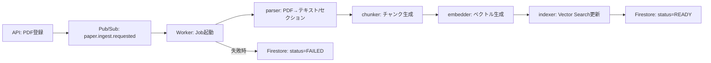

# パイプライン開発スキル

## 技術スタック

- **実行環境**: Cloud Run Jobs（Worker）
- **トリガー**: Pub/Sub イベント / APIからのJob実行
- **PDF処理**: PyMuPDF または pdfplumber
- **AI**: Vertex AI Embeddings
- **検索**: Vertex AI Vector Search
- **状態管理**: Firestore（INGESTING / READY / FAILED）

## ディレクトリ構成

```
apps/api/worker/
├── main.py                 # Cloud Run Job エントリーポイント
├── pipeline/
│   ├── __init__.py
│   ├── ingest.py           # オーケストレーター（パース→チャンク→埋め込み→インデックス）
│   ├── parser.py           # PDF パース（テキスト/セクション抽出）
│   ├── chunker.py          # チャンク生成（セクション/ページ/オフセット メタ含む）
│   ├── embedder.py         # Vertex AI Embedding 呼び出し
│   └── indexer.py          # Vector Search インデックス アップサート
└── __init__.py
```

## パイプラインフロー



## 開発ルール

### 冪等性（Idempotent）

1. 同じ `paperId` で再実行しても結果が一貫すること
2. チャンク/エンベディングは `paperId` + `chunkId` で一意に管理
3. Vector Searchはアップサートで既存データを上書き

### 状態管理

1. パイプライン開始時: `status = "INGESTING"`
2. 成功時: `status = "READY"`, `finishedAt` を記録
3. 失敗時: `status = "FAILED"`, `error` メッセージを記録

### エラーハンドリング

1. パース失敗: 1回リトライ → FAILED
2. 埋め込み/インデックス失敗: 指数バックオフで最大3回リトライ
3. すべての例外はキャッチしてFirestoreにエラー状態を反映

### チャンク設計

1. チャンクサイズ: 500〜1000トークン（オーバーラップ100トークン）
2. メタデータ必須: `section`, `pageRange`, `offset`, `chunkId`
3. LLMレスポンスは必ず `sourceChunkId` / `pageRange` 等の根拠を含む

### ログ/監視

1. 構造化ログ: `requestId`, `paperId`, `step`, `duration` を含む
2. Cloud Logging で検索可能なフォーマット
3. エラーは Cloud Error Reporting に自動連携

## Pub/Sub イベント設計

### トピック

| トピック名               | 用途                |
| ------------------------ | ------------------- |
| `paper.ingest.requested` | PDF取り込み開始依頼 |
| `paper.ingest.completed` | 取り込み完了通知    |
| `paper.ingest.failed`    | 取り込み失敗通知    |

### メッセージフォーマット

```json
{
  "paperId": "string",
  "ownerUid": "string",
  "pdfUrl": "gs://bucket/path/to/pdf",
  "requestId": "string",
  "timestamp": "ISO8601"
}
```

## Firestoreエンティティ

### PaperIngestJob

```
papers/{paperId}/ingest_jobs/{jobId}
{
  "paperId": "string",
  "status": "INGESTING" | "READY" | "FAILED",
  "startedAt": "timestamp",
  "finishedAt": "timestamp | null",
  "error": "string | null",
  "chunkCount": "number",
  "requestId": "string"
}
```

### PaperChunk

```
papers/{paperId}/chunks/{chunkId}
{
  "paperId": "string",
  "chunkId": "string",
  "section": "string",
  "text": "string",
  "pageRange": [startPage, endPage],
  "offset": "number",
  "embeddingRef": "string"
}
```

## Vector Search アップサートフォーマット

```json
{
  "id": "{paperId}_{chunkId}",
  "embedding": [0.1, 0.2, ...],
  "restricts": [
    {"namespace": "ownerUid", "allow": ["uid_value"]},
    {"namespace": "paperId", "allow": ["paper_id_value"]}
  ]
}
```

## Cloud Run Jobs 設定

- CPU: 2 vCPU / メモリ: 2〜4GB
- 同時実行数: 1（推奨）
- タイムアウト: 10〜30分
- リトライ: 最大3回

## TODOフォーマット

```python
# TODO(F-xxxx, MIRO:ノードID): 作業要約 | AC:完了条件 | owner:@
```
