# AI Paper プロジェクト概要（ブログ用）：システムアーキテクチャ / ドメインロジック / 技術スタック

このドキュメントは `프로젝트_서비스_구조_및_도메인별_기능서.md` をベースに、ブログ公開向けに整えた日本語版です。  
構成は **「システムアーキテクチャ → クラウドアーキテクチャ → ドメイン別フロー → API一覧 → 技術スタック」** の順です。

---

## 1. システムアーキテクチャ（全体像）

AI Paper は「論文検索 → 保存 → 要約 → 関連論文推薦」を一連で実行するワークフローを提供します。

- **Frontend**: Next.js アプリで、検索・ライブラリ・プロジェクト・読書 UI を提供
- **Backend API**: FastAPI 単一サービス（モジュラーモノリス）でドメインルートを統合運用
- **非同期パイプライン**: アップロード / パース / 埋め込み / インデックス化を Cloud Run Job へ分離
- **AI検索**: Vertex AI の埋め込み + Vector Search で意味検索と関連論文推薦を実現

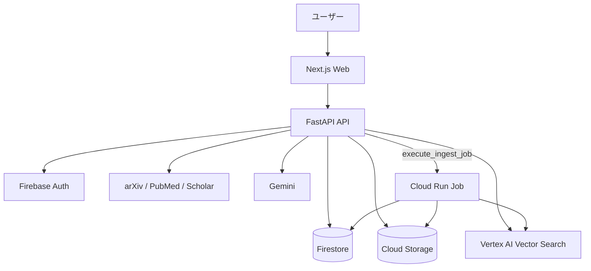

### 1.1 主要データフロー
1. ユーザーが検索・保存リクエストを送信 → FastAPI が処理
2. 論文の PDF URL もしくはアップロードファイルを確認
3. PDF は Cloud Storage ベースのワークフローに入る
4. Worker が PDF の解析、チャンク化、埋め込み、インデックス更新を実施
5. 結果を Firestore と Vector Search に反映
6. 検索・関連推薦・要約・質問回答で結果を組み合わせて返却

---

## 2. クラウドアーキテクチャ

運用前提: `Pub/Sub` ベースのイベント消費は現在使用せず、API 呼び出しで Worker を直接起動します。

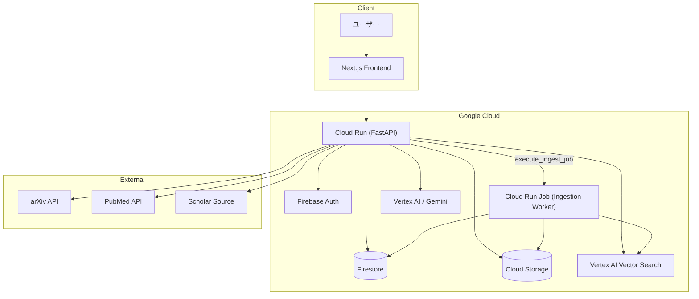

### 2.1 クラウド分離を採用した理由
- **Web/Backend 分離**: 画面描画とトランザクション/推論層を分離
- **非同期 Worker 分離**: 埋め込みやインデックス更新など、時間とコストが大きい処理を Job で切り出し
- **ストレージ分離**: メタ情報（Firestore）とバイナリ（Cloud Storage）を分離
- **AI 専用層分離**: 検索専用の Vector Search と API レイヤーを分離

---

## 3. ドメイン別ロジック説明（説明 + Mermaid）

各ドメインは `apps/api/app/modules/{domain}` に分割され、ルートは `/api/v1` 配下で公開されます。

### D-01 Auth & User
Firebase JWT を検証した後、ユーザー情報を作成・取得し、プロフィールを返します。

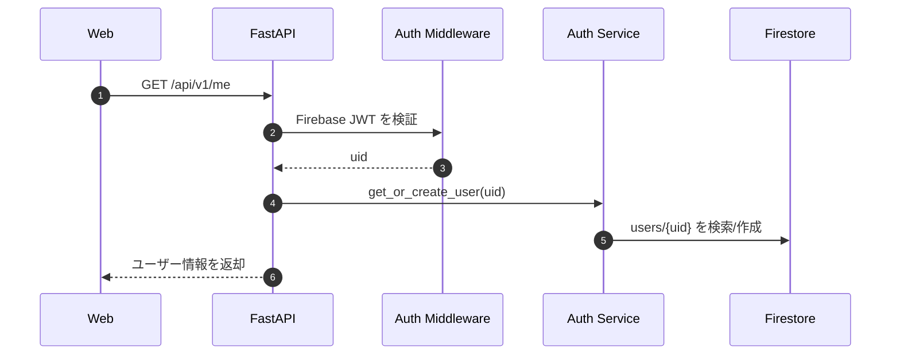

### D-02 Project (My Paper)
プロジェクトを作成・取得・更新し、関連論文の追加・削除、および TeX ファイル連携を行います。

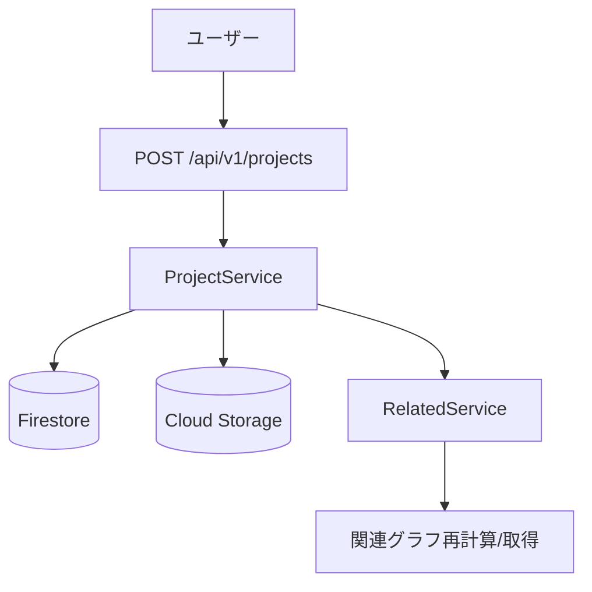

### D-03 Paper Library
検索結果をライブラリへ保存（いいね）し、保存状態に応じてインジェストパイプラインを起動します。

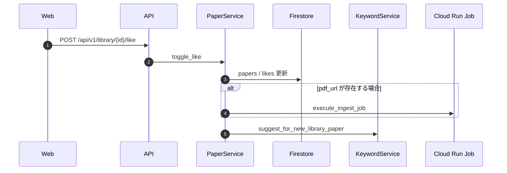

### D-04 Search
arXiv / PubMed / Scholar の3ソース＋ Gemini fallback を `source` ポリシーで選択し、結果を統合・重複除去・ランキングします。  
`source=auto` はクエリ内容から分野を推定して優先順を決め、未達分を補完します。

- ルータ: `GET /api/v1/search/papers`、`POST /api/v1/search/papers/recluster`
- サービス: `SearchService.search_papers`, `search_papers_reclustered`
- 共通制御:
  - `FirestoreRateLimiter` がサービス別に最小間隔を制御（Firestoreトランザクション）
  - arXiv/PubMed/Scholar 共通で `_wait_for_rate_limit` を実行
- 除外・ランキング:
  - 外部ID（ArXiv/DOI/PubMed）重複を除去
  - タイトル一致度 + 年 + タイトル辞書順でソート
  - `uid` が付く場合は likes を参照して `is_in_library` を付与

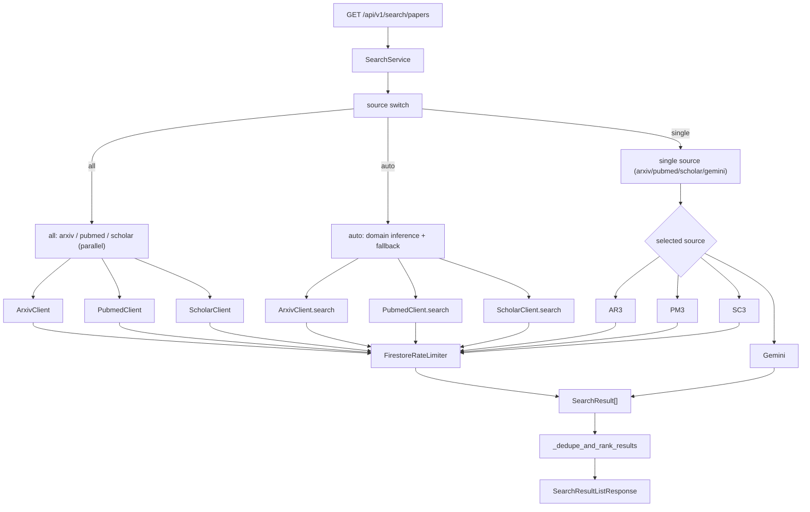

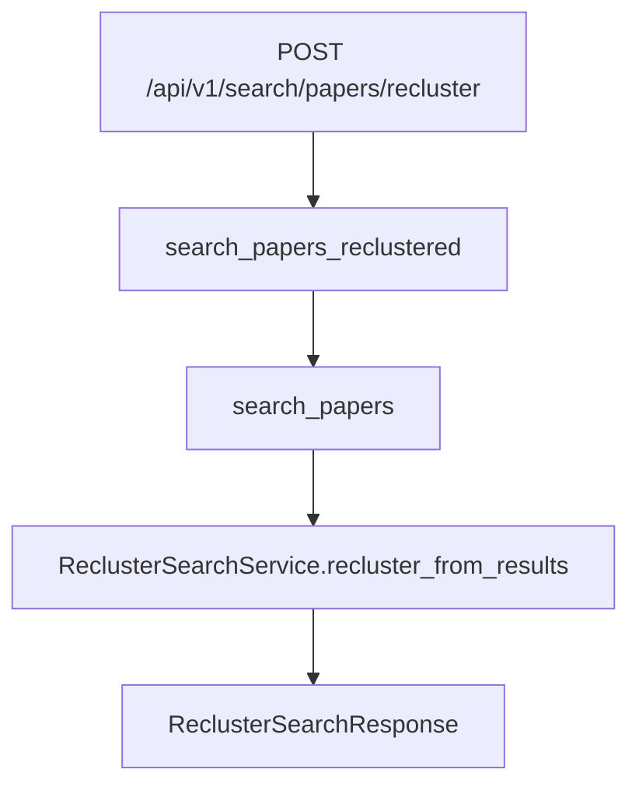

### D-05 Ingestion Pipeline（非同期）
`POST /api/v1/library/{id}/like` または `/upload` / `/ingest` で起動されます。現在は API が Job を直接実行します。

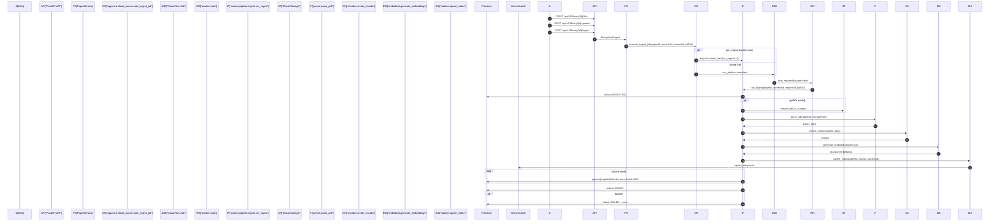

- トリガー条件:
  - `toggle_like` で `pdf_url` がある場合、`is_new_paper` でもなくても `execute_ingest_job` が起動
  - `upload` は `papers/{uid}/{paperId}.pdf` を保存後に手動起動
  - `ingest` はストレージ既存前提で `pdf_url` を渡さず起動
- Cloud Run呼び出し仕様:
  - `project_id`, `location`, `job name` が未設定の場合は実行をスキップしてログのみ
  - `run_ingest_locally=true` 時は worker module を import して `asyncio.create_task` で直接実行
- パイプライン詳細:
  - 解析ステータスは `INGESTING -> READY/FAILED` を Firestore 更新
  - `pdf_url` がある場合のみ `ensure_pdf_in_storage` で不足時のみダウンロード保存
  - `chunk` の Firestore 書き込みはバッチ 400 件でコミット
  - embedding は Firestore 保存せず Vector Search 側にのみ保存
- 注意点:
  - `vector_index_id` 未設定やダミー値では index 更新がスキップされるため、検索精度に影響
  - チャンク化仕様: `CHUNK_SIZE=1000` / `CHUNK_OVERLAP=200`、`chunk_id` は UUID、`page_number` と文字範囲を保持
  - 埋め込み仕様: `worker/pipeline/embedder.py` は chunk 単位に `text-embedding-004` をバッチ（5件）で実行し、`RETRIEVAL_DOCUMENT` を使う
  - 検索/関連算出時の query embedding は `app/core/embedding.py` で `RETRIEVAL_QUERY`
  - ベクトル保存: Firestore には Embedding を持たず、Vertex AI Vector Search の Datapoint (`datapoint_id=chunk_id`) に保存
  - 検索時は `MatchingEngineIndexEndpoint.find_neighbors` では `deployed_index_id="ai_paper_deployed_index"` を利用

### D-06 Keyword & Tagging
ドメインキーワードの作成・更新を行い、論文タグ（manual）と自動推薦タグ（auto）を扱います。  
autoタグは再計算時に置き換え、manualタグは保持します。

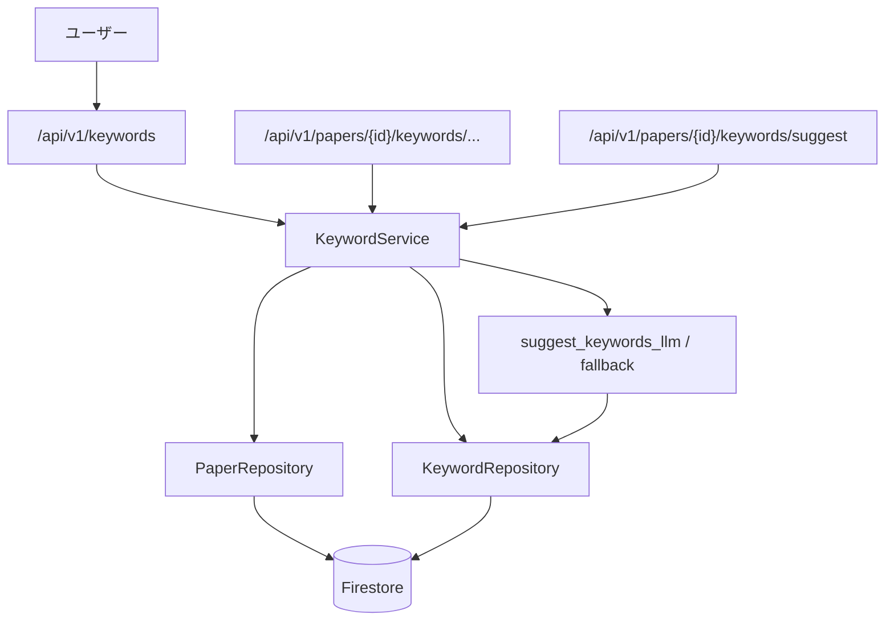

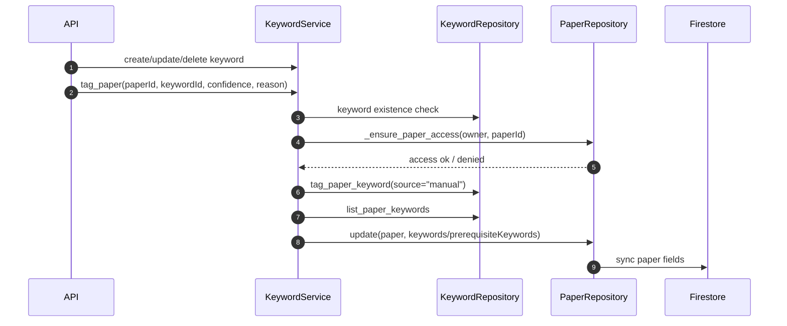

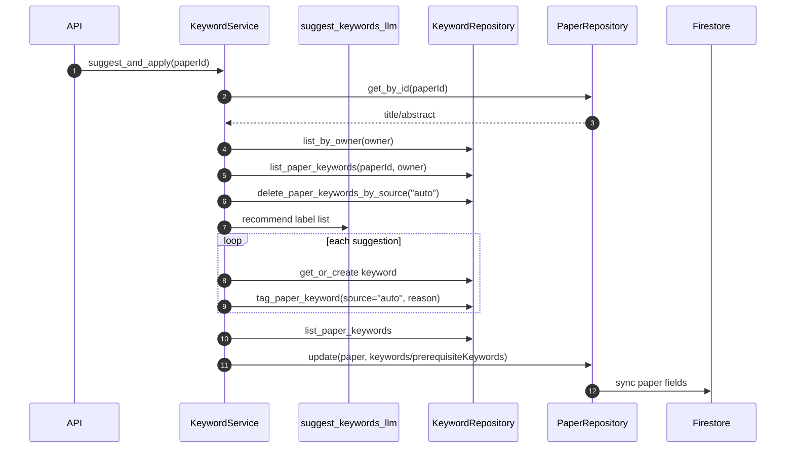

### D-07 Related Graph
論文間の近接は「Vector Search + キーワード共起」の2層で作ります。  
関連記事 APIとグラフ APIで、どこまで埋め込み・インデックスを使うかを分けて記述します。

#### D-07.1 関連論文（/papers/{id}/related）
ベクトル検索で候補を取得し、Firestore で再取得してキーワード/Jaccard と被引用数を再スコアしています。

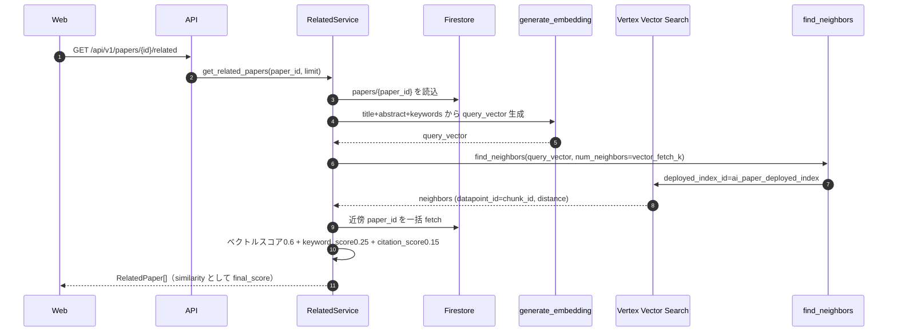

- 実装対応:
  - `get_related_papers` は 1stステージでベクトル類似度を取得後、`_keyword_jaccard` と `citation_count` を再評価
  - `query_vector` は `app/core/embedding.py` の `generate_embedding`（`RETRIEVAL_QUERY`）を使用
  - 現在実装は近傍IDを `papers/{id}` の主キーとみなして fetch するため、IDが chunk_id 由来の場合は不整合注意
  - 候補上位を `PaperRepository` ではなく `Firestore` から fetch し、`paperId != source` を除外
  - スキーマ `RelatedPaper` は `similarity` を最終スコアとして返却

#### D-07.2 グラフ（/projects/{id}/graph, /graph）
`project graph` と `global graph` は、ドメインルール上で `owned / related / project` ノードを分離し、接続は2種のブリッジで追加します。

```mermaid
flowchart TD
  W["ユーザー"] --> A["GET /api/v1/projects/{projectId}/graph"]
  A --> R[RelatedService.get_project_graph]
  R --> FS[(Firestore Projects)]

  W --> G["GET /api/v1/graph"]
  G --> RG[RelatedService.get_global_graph]
  RG --> FS2[(Firestore)]
  FS2 --> P1[paper nodes]
  FS2 --> P2[keyword overlap edges]
  RG --> V[Embedding bridges]
  RG --> K[keyword bridges]
  RG --> C[(users/{uid}/cache)]
```

- `/projects/{id}/graph`
  - Project ノード + project papers ノードを追加
  - project-paper エッジ値は 1.0 固定
  - project 内だけの追加接続はキーワード重なり（phrase overlap）で `owned/related` 区別なし
- `/graph`
  - 事前: Firestore からユーザーの project / liked papers を収集
  - ノード分類:
    - `project`: グループIDを持つプロジェクト
    - `related`: project 配下の paper
    - `owned`: プロジェクト非所属だがライブラリにある paper
  - bridge 追加モード:
    - `keyword`: キーワード phrase 重なりで `keyword_bridge_score` を付与
    - `embedding`: `get_related_papers` の類似スコアを使って owned ↔ related を接続
    - `hybrid`: 両方を同時適用
  - `graph_connection_mode` と一致する doc に結果キャッシュ（`graph_global_{mode}`）

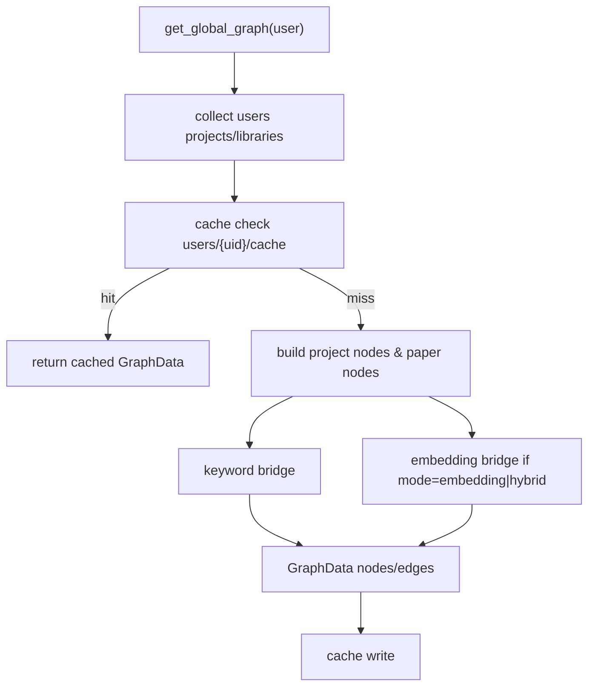

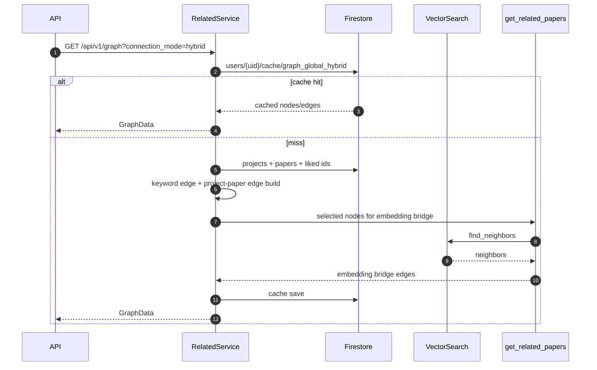

### D-07.3 関連補足
- 関連論文一覧では、最終スコアを作るために embedding だけに依存しない
- `vector_index_id` が未設定の場合は埋め込みインデックス更新が回避されるため、`/related` と `/graph` の埋め込みブリッジは機能低下
- `related graph` は `Paper` のメタ情報を前提にし、Graph には chunk 自体を直接持たない

### D-08 Memo & Notes
論文・チャンク・キーワードに紐づくメモを作成し、CRUD で管理します。

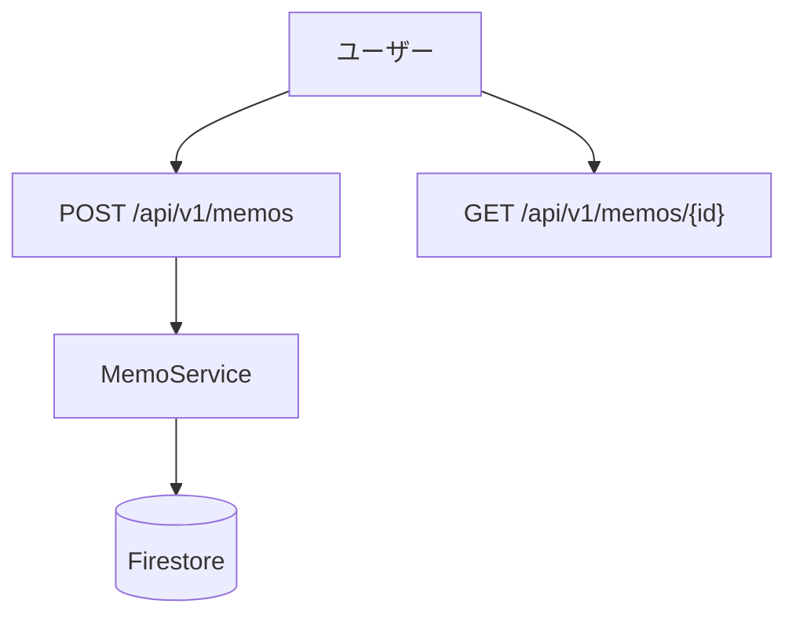

### D-09 Reading Support
PDF のメタ情報・チャンク取得、文の解説、ライブラリ Q&A に対応します。

```mermaid
flowchart LR
  W["ユーザー"] --> O["GET /api/v1/papers/{id}/outline, /chunks"]
  O --> RS[ReadingService]
  RS --> C[(Firestore: papers/{id}/chunks)]
  X["POST /api/v1/papers/{id}/explain"] --> RS
  L["POST /api/v1/library/ask"] --> RS
  RS --> VS["Vertex Vector Search"]
  RS --> GEM[Gemini]
  RS --> A[Answer + citations]
```

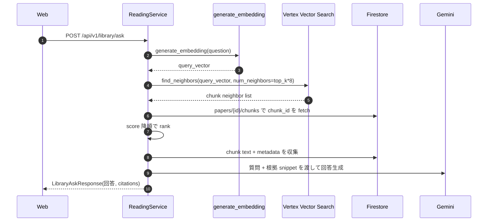

- 重要:
  - `/api/v1/papers/{paper_id}/chunks` は Firestore に保存されたチャンクの再利用 API
  - `ask_library` は query embedding を使い、その後 `paper_id` フィルタでライブラリ内 only に絞る
  - ベクトル検索でヒットなしの場合は、キーワードベースの fallback を実行

### D-10 TeX & BibTeX
プロジェクト内の TeX ファイルの一覧取得・参照・保存・削除・コンパイル・プレビューを管理します。

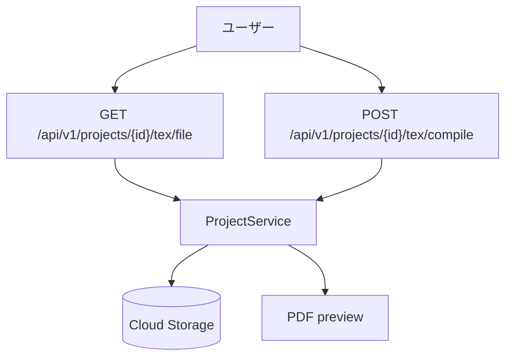

### D-11 Agent
`/api/v1/agent/chat` を使って、検索・保存・プロジェクト作成・読書操作を 1 つのフローにまとめて実行します。

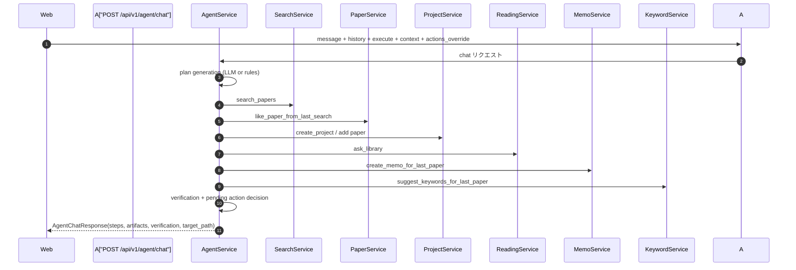

#### D-11 詳細
- `actions_override` がある場合は先頭 60 件をそのまま実行プラン化
- LLM計画が有効な場合のみ `functions` から allowed action を組み立て
  - `search_papers`, `like_paper_from_last_search`, `create_project`, `add_paper_to_project`, `add_last_liked_paper_to_project`, `list_library`, `ask_library`, `create_memo_for_last_paper`, `suggest_keywords_for_last_paper`, `get_related_for_last_paper`, `compile_project_tex`
- 失敗時には簡易リトライ:
  - `like_paper_from_last_search` は次 index で再実行
  - `add_last_liked_paper_to_project` は `add_paper_to_project` に置換
- 実行状態は `state` に保持:
  - `last_search_results`, `last_liked_paper_id`, `last_project_id`, `artifacts`
- `verification`:
  - Gemini 利用時は JSON 評価（`met/partial/not_met`）
  - 失敗時は `achieved` / `missing` を簡易推定
- `target_path` は実行完了情報から決定（`/search`, `/library`, `/papers/{id}`, `/projects/{id}`）

---

## 4. 技術スタック

| 区分 | 技術 | 用途 |
|---|---|---|
| Frontend | Next.js, TypeScript, Tailwind CSS, shadcn/ui | 画面構築、認証連携、レスポンシブ UI |
| Backend | FastAPI, Pydantic, Firebase Admin SDK | 認証ミドルウェア、ドメインルート/サービス構造 |
| Data | Firestore, Cloud Storage | メタデータ、ライブラリ/メモ/キーワード保存、PDF 保管 |
| AI/検索 | Vertex AI Gemini, text-embedding-004, Vertex AI Vector Search | 要約拡張、意味検索、チャンク解説、ベクトル類似検索 |
| 外部検索API | arXiv, PubMed, Scholar(スクレイピング) | 論文ソースの収集 |
| 非同期処理 | Cloud Run Jobs, Python asyncio | PDF パイプラインの分離実行 |
| デプロイ | Docker, Cloud Run, Cloud Build | API/Worker の配備と運用 |

---

## 5. 主要 API 一覧

### 5.1 認証 / プロジェクト / 論文（ドメイン）主要 API

| Domain | Method | Endpoint | 説明 |
|---|---|---|---|
| Auth | GET | `/api/v1/me` | ログインユーザー情報の取得 |
| Auth | PATCH | `/api/v1/me` | プロフィール / 設定更新 |
| Search | GET | `/api/v1/search/papers` | 外部ソースベースの論文検索 |
| Search | POST | `/api/v1/search/papers/recluster` | 検索結果の再クラスタリング（再整列） |
| Library | GET | `/api/v1/library` | ライブラリ一覧 |
| Library | GET | `/api/v1/library/{id}` | 論文詳細 |
| Library | POST | `/api/v1/library/{id}/like` | 論文のいいね（保存/解除） |
| Library | DELETE | `/api/v1/library/{id}/like` | いいね解除 |
| Library | POST | `/api/v1/library/{id}/upload` | PDF アップロード + 自動インジェスト |
| Library | POST | `/api/v1/library/{id}/ingest` | 手動インジェスト再実行 |
| Project | POST | `/api/v1/projects` | プロジェクト作成 |
| Project | GET | `/api/v1/projects` | プロジェクト一覧 |
| Project | GET | `/api/v1/projects/{id}` | プロジェクト詳細 |
| Project | PATCH | `/api/v1/projects/{id}` | プロジェクト更新 |
| Project | DELETE | `/api/v1/projects/{id}` | プロジェクト削除 |
| Project | POST | `/api/v1/projects/{id}/papers` | プロジェクトへの論文追加 |
| Project | DELETE | `/api/v1/projects/{id}/papers/{paperId}` | プロジェクト論文の削除 |
| Project | GET | `/api/v1/projects/{id}/tex/files` | TeX ファイル一覧 |
| Project | GET | `/api/v1/projects/{id}/tex/file` | TeX ファイル取得 |
| Project | GET | `/api/v1/projects/{id}/tex/file/raw` | TeX 生データ取得 |
| Project | POST | `/api/v1/projects/{id}/tex/file` | TeX ファイル保存 |
| Project | DELETE | `/api/v1/projects/{id}/tex/file` | TeX ファイル削除 |
| Project | POST | `/api/v1/projects/{id}/tex/upload` | TeX 素材のアップロード |
| Project | POST | `/api/v1/projects/{id}/tex/compile` | TeX コンパイル |
| Project | GET | `/api/v1/projects/{id}/tex/preview` | コンパイル結果メタ取得 |
| Project | GET | `/api/v1/projects/{id}/tex/preview/pdf` | PDF ダウンロード / 表示 |

### 5.2 検索 / タグ / 読書 / メモ / 関連 / Agent API

| Domain | Method | Endpoint | 説明 |
|---|---|---|---|
| Keyword | POST | `/api/v1/keywords` | キーワード作成 |
| Keyword | GET | `/api/v1/keywords` | キーワード一覧 |
| Keyword | PATCH | `/api/v1/keywords/{id}` | キーワード更新 |
| Keyword | DELETE | `/api/v1/keywords/{id}` | キーワード削除 |
| Keyword | POST | `/api/v1/papers/{id}/keywords` | 論文への手動タグ付け |
| Keyword | GET | `/api/v1/papers/{id}/keywords` | 論文タグ一覧 |
| Keyword | DELETE | `/api/v1/papers/{id}/keywords/{keywordId}` | 論文タグ削除 |
| Keyword | POST | `/api/v1/papers/{id}/keywords/suggest` | 自動タグ候補適用 |
| Related | GET | `/api/v1/papers/{id}/related` | 関連論文推薦 |
| Related | GET | `/api/v1/projects/{projectId}/graph` | プロジェクト関連グラフ |
| Related | GET | `/api/v1/graph` | 全体グラフ |
| Keyword Related | GET | `/api/v1/papers/{id}/library-related-by-keywords` | キーワードベース推薦 |
| Reading | GET | `/api/v1/papers/{id}/outline` | 論文アウトライン取得 |
| Reading | GET | `/api/v1/papers/{id}/chunks` | チャンク一覧取得 |
| Reading | POST | `/api/v1/papers/{id}/explain` | 文や選択テキストの解説 |
| Reading | POST | `/api/v1/papers/{id}/highlights` | ハイライト保存 |
| Reading | GET | `/api/v1/papers/{id}/highlights` | ハイライト一覧 |
| Reading | POST | `/api/v1/library/ask` | ライブラリ Q&A |
| Memo | GET | `/api/v1/memos` | メモ一覧 |
| Memo | POST | `/api/v1/memos` | メモ作成 |
| Memo | GET | `/api/v1/memos/{id}` | メモ詳細 |
| Memo | PATCH | `/api/v1/memos/{id}` | メモ更新 |
| Memo | DELETE | `/api/v1/memos/{id}` | メモ削除 |
| Agent | POST | `/api/v1/agent/chat` | 検索・保存・プロジェクト・要約フロー実行 |

---

## 6. まとめ

この文書はブログ本文として、そのまま利用できるように  
**「構成 + ドメインロジック + 実行 API」** を一括で整理しています。  
現在の運用前提として **Pub/Sub 未使用、API 起動型 Cloud Run Job** が核心なので、設計説明ではこの点を明示することが重要です。
