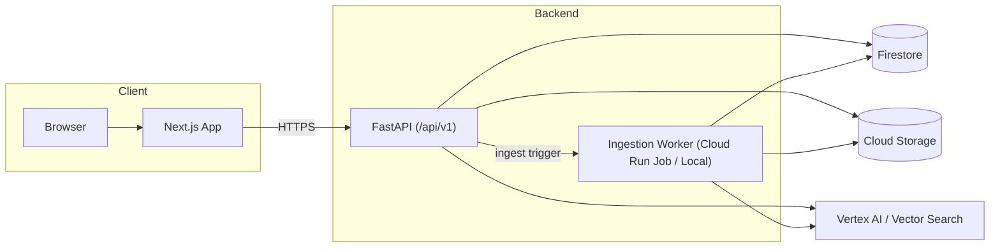

# 論文管理サービス ドキュメントポータル

## 概要

論文検索/保存(いいね)/メモ/関連研究選択を通じて、ユーザーが「マイペーパープロジェクト」を作成・管理するWebサービス。

## ドキュメント一覧

### アーキテクチャ

- [Firestoreスキーマ設計](./firestore-schema.md)
- [API仕様書](./api-contracts.md)
- [画面遷移図](./screen-flow.md)
- [ユースケース一覧（ユーザー視点）](./use-case.md)

```
── apps/
│   ├── web/                    # Next.js フロントエンド
│   │   └── src/
│   │       ├── app/            # App Router ページ群（search, library, papers, projects, memos, graph など）
│   │       ├── components/ui/  # 共通UIコンポーネント
│   │       └── lib/api/        # 型付きAPIクライアント群
│   └── api/                    # FastAPI バックエンド
│       ├── app/
│       │   ├── core/           # config, firebase_auth, firestore
│       │   ├── main.py         # エントリーポイント + CORS + /healthz
│       │   └── modules/        # ドメインモジュール
│       │       ├── auth/       # D-01
│       │       ├── agent/      # D-11
│       │       ├── papers/     # D-03
│       │       ├── projects/   # D-02
│       │       ├── search/     # D-04
│       │       ├── memos/      # D-08
│       │       ├── keywords/   # D-06
│       │       ├── related/    # D-07
│       │       ├── keyword_related/ # D-12
│       │       ├── reading/    # D-09
│       │       └── tex/        # D-10
│       ├── worker/             # D-05 パイプライン
│       │   ├── main.py
│       │   └── pipeline/       # parser, chunker, embedder, indexer
│       ├── tests/
│       ├── Dockerfile          # APIサービス用
│       └── Dockerfile.worker   # Worker用
├── packages/shared/            # 共有TypeScript型
├── infra/                      # GCPインフラスペック
├── docs/                       # 設計ドキュメント
└── .agent/workflows/           # 開発スキル
```



### ドメイン機能書（D-01〜D-12）

| ID   | ドメイン             | ドキュメント                                                       |
| ---- | -------------------- | ------------------------------------------------------------------ |
| D-01 | 認証 & ユーザー      | [D-01-auth-user.md](./domains/D-01-auth-user.md)                   |
| D-02 | プロジェクト         | [D-02-project.md](./domains/D-02-project.md)                       |
| D-03 | ペーパーライブラリ   | [D-03-paper-library.md](./domains/D-03-paper-library.md)           |
| D-04 | 論文検索             | [D-04-paper-search.md](./domains/D-04-paper-search.md)             |
| D-04+ | 検索結果クラスタ再整理 | [D-04-search-clustered-results.md](./domains/D-04-search-clustered-results.md) |
| D-05 | 取り込みパイプライン | [D-05-ingestion-pipeline.md](./domains/D-05-ingestion-pipeline.md) |
| D-06 | キーワード & タグ    | [D-06-keyword-tagging.md](./domains/D-06-keyword-tagging.md)       |
| D-07 | 関連グラフ           | [D-07-related-graph.md](./domains/D-07-related-graph.md)           |
| D-07+ | キーワードブリッジ開発計画 | [D-07-keyword-bridge-experiment.md](./domains/D-07-keyword-bridge-experiment.md) |
| D-08 | メモ & ノート        | [D-08-memo-notes.md](./domains/D-08-memo-notes.md)                 |
| D-09 | 読解サポート         | [D-09-reading-support.md](./domains/D-09-reading-support.md)       |
| D-10 | TeX & BibTeX         | [D-10-tex-bibtex.md](./domains/D-10-tex-bibtex.md)                 |
| D-11 | AIエージェント       | [D-11-ai-agent.md](./domains/D-11-ai-agent.md)                     |
| D-12 | キーワード起点ライブラリ関連 | [D-12-keyword-library-related.md](./domains/D-12-keyword-library-related.md) |

### 開発ガイド

- [フロントエンド開発ルール](../.agent/workflows/frontend.md)
- [バックエンド開発ルール](../.agent/workflows/backend.md)
- [パイプライン開発ルール](../.agent/workflows/pipeline.md)
- [プロジェクト共通規約](../.agent/workflows/project-conventions.md)

## 技術スタック

| レイヤー       | 技術                                            |
| -------------- | ----------------------------------------------- |
| フロントエンド | Next.js (TypeScript) + shadcn/ui + Tailwind CSS |
| バックエンド   | FastAPI (Python) + Docker → Cloud Run           |
| データベース   | Firestore                                       |
| ストレージ     | Cloud Storage                                   |
| 非同期処理     | Pub/Sub + Cloud Run Jobs                        |
| AI/検索        | Vertex AI (Gemini/Embeddings) + Vector Search   |
| 認証           | Firebase Auth                                   |

## ローカル起動

### フロントエンド

```bash
cd apps/web && npm install && npm run dev
```

### バックエンド

```bash
cd apps/api && pip install -r requirements.txt && uvicorn app.main:app --reload --port 8000
```
