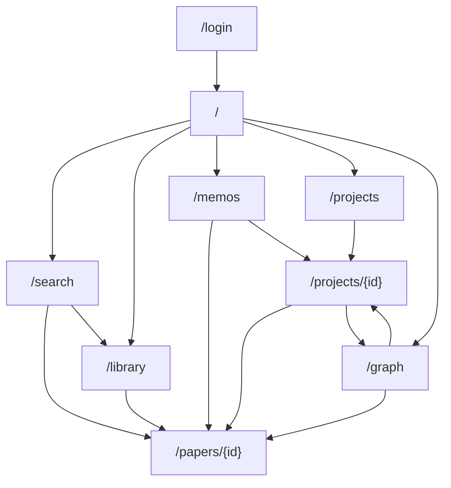

# 画面遷移図（Screen Flow）

## 概要

本ドキュメントは、ユーザーの主要導線を画面遷移として示す。
システム構成（インフラ/実行基盤）は `docs/README.md` のアーキテクチャ図を参照。

## 主要画面遷移

## 備考

- 論文詳細（`/papers/{id}`）では、概要/PDF/メモ/関連のタブ導線を持つ。
- プロジェクト詳細（`/projects/{id}`）では、文献管理と TeX 編集/コンパイルを行う。
- 実際のUI制御（モーダル、タブ内遷移）はこの図では省略している。
