# AI Paper 프로젝트 블로그 정리: 시스템 아키텍처, 도메인 로직, 기술 스택

이 문서는 `프로젝트_서비스_구조_및_도메인별_기능서.md`를 기반으로 블로그 포맷에 맞춰 정리한 버전이다.  
구성은 **“시스템 아키텍처 → 클라우드 아키텍처 → 도메인별 로직 → 사용 API → 기술 스택”** 순으로 담았다.

---

## 1. 시스템 아키텍처 (기본 구조)

AI Paper는 “논문 검색-저장-요약-연결”의 완결 워크플로우를 제공한다.

- **Frontend**: Next.js 앱에서 검색/라이브러리/프로젝트/읽기 UI를 제공
- **Backend API**: FastAPI 단일 서비스(모듈형 모놀리식)로 도메인 라우트를 통합 운영
- **비동기 파이프라인**: 업로드/파싱/임베딩/인덱싱은 Cloud Run Job으로 분리
- **AI 검색**: Vertex AI 기반 임베딩 + Vector Search로 semantic 검색과 관련 논문 추천 수행

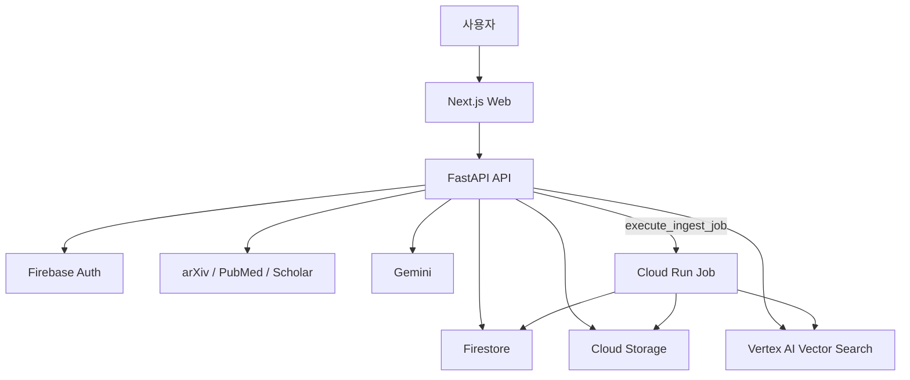

### 1.1 핵심 데이터 흐름
1. 사용자 검색/저장 요청 → FastAPI 처리
2. 논문 PDF URL 또는 업로드 파일 확인
3. 업로드된 PDF는 Cloud Storage 기반으로 워크플로우 진입
4. Worker가 PDF 파싱/청크/임베딩/인덱싱 수행
5. 결과는 Firestore + Vector Search에 반영
6. 검색/관련/요약/질의 기능에서 결과를 조합해 응답

---

## 2. 클라우드 아키텍처

운영 기준: `Pub/Sub` 소비형 이벤트는 현재 사용하지 않고, API 호출 기반으로 Worker를 직접 실행한다.

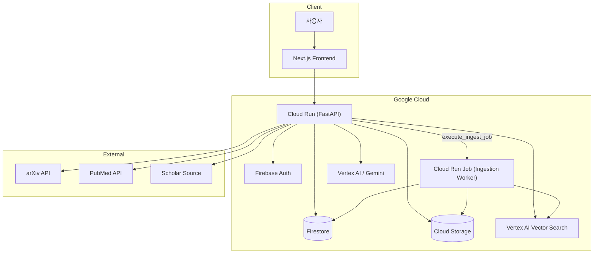

### 2.1 왜 클라우드 분리를 했는가
- **Web/Backend 분리**: 화면 렌더링과 추론/트랜잭션 계층 분리
- **비동기 Worker 분리**: 임베딩/인덱싱처럼 비용/시간이 큰 작업은 Job으로 분리
- **문서 저장소 분리**: 메타데이터(Cloud Firestore)와 원본 파일(Cloud Storage) 분리
- **AI 전용 계층 분리**: 검색용 Vector Search와 서빙 API 분리 운영

---

## 3. 도메인별 로직 설명 (설명 + Mermaid)

각 도메인은 `apps/api/app/modules/{domain}`으로 분리되어 있고, 라우트는 `/api/v1` 기준으로 노출된다.

### D-01 Auth & User
Firebase JWT로 인증 후 사용자 문서를 조회/생성하고 프로필을 조회한다.

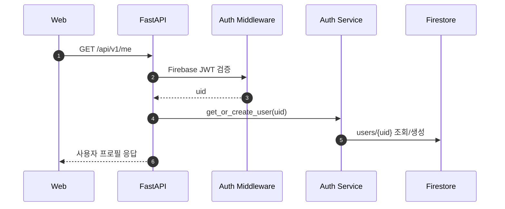

### D-02 Project (My Paper)
내부 프로젝트를 생성/조회/수정하고, 참조 논문을 추가/삭제하며 TeX 파일 집합과 연동한다.

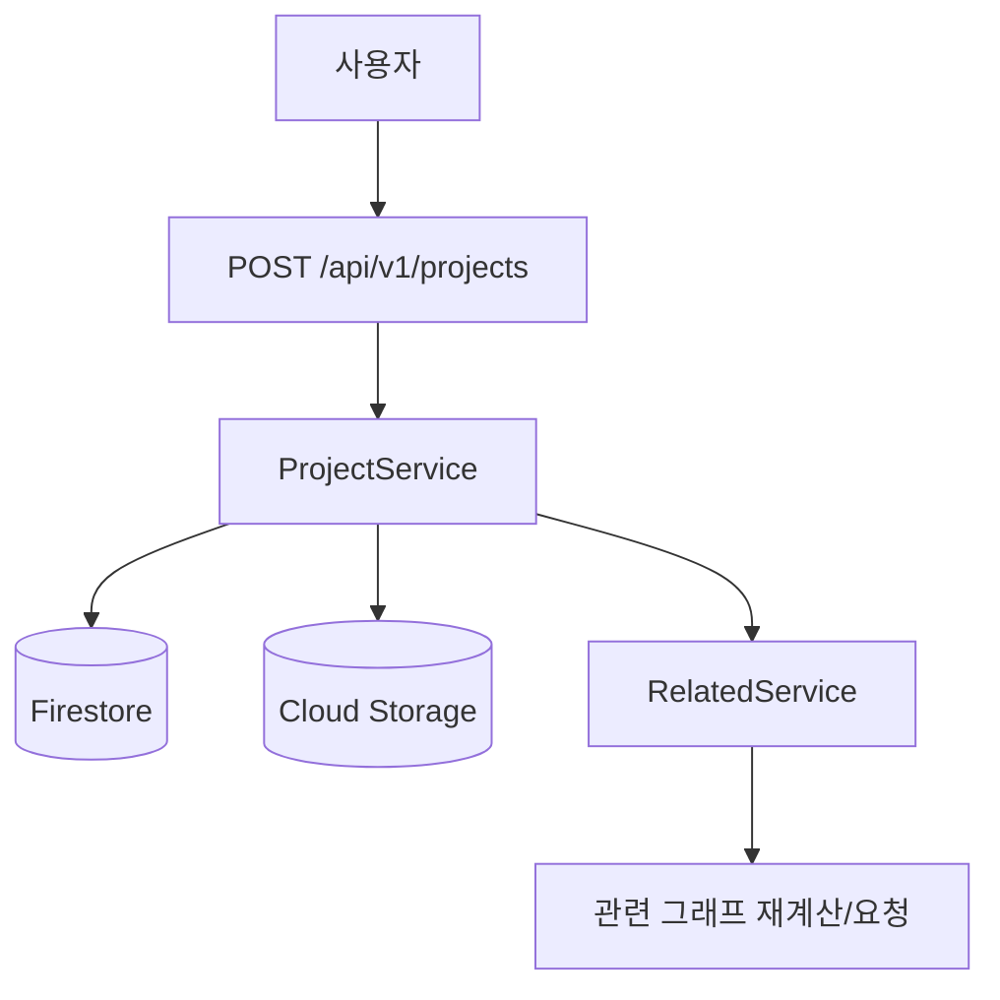

### D-03 Paper Library
검색 결과를 내 라이브러리에 저장(좋아요)하고, 상태를 기반으로 파이프라인을 유도한다.

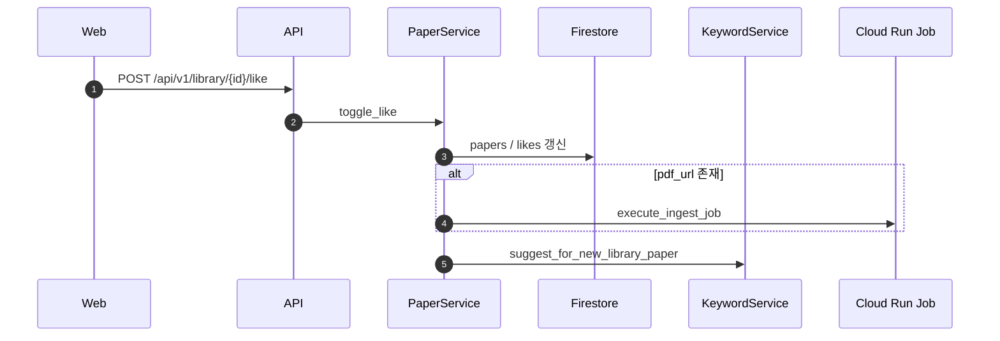

### D-04 Search
arXiv, PubMed, Scholar 3개 소스 + Gemini fallback 를 source 정책에 따라 호출하고, 결과를 병합/중복제거/정렬한다.

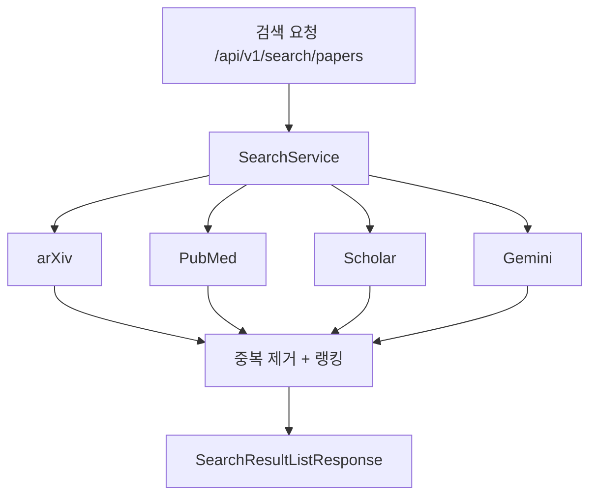

### D-05 Ingestion Pipeline (Async)
`POST /api/v1/library/{id}/like` 또는 `/upload`/`/ingest`에서 실행된다. 현재는 API가 Job을 직접 실행한다.

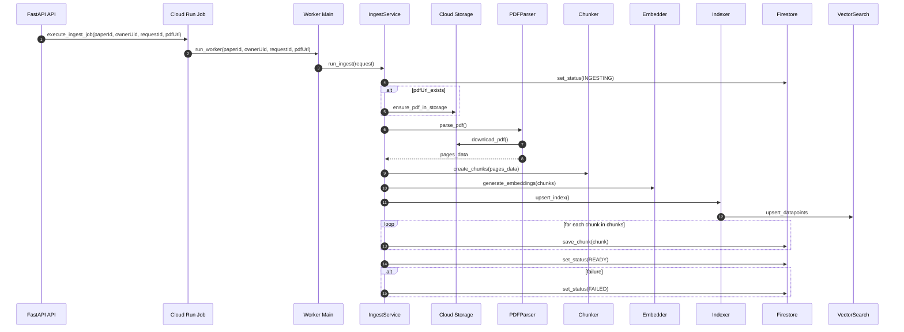

### D-06 Keyword & Tagging
도메인 키워드를 수동 생성/수정하고, 논문 단위 태그 관리 및 자동 추천 파이프라인을 제공한다.

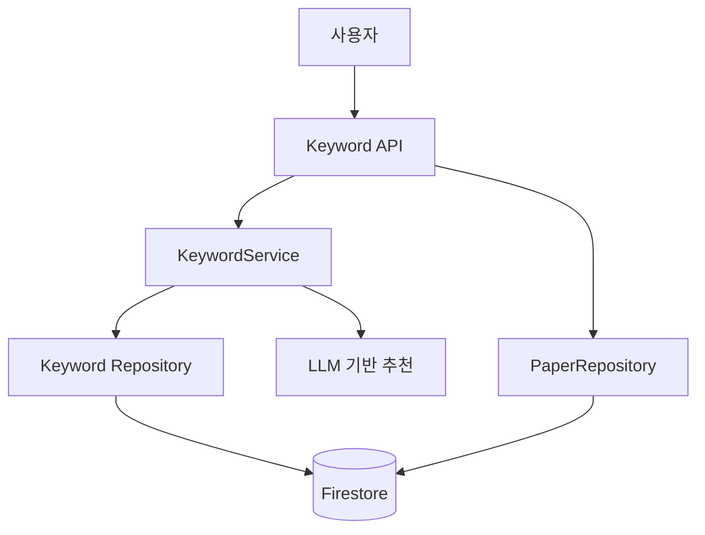

### D-07 Related Graph
논문 간 벡터 유사도 + 키워드 점수를 조합해 관련 논문 리스트 및 그래프 데이터를 생성한다.

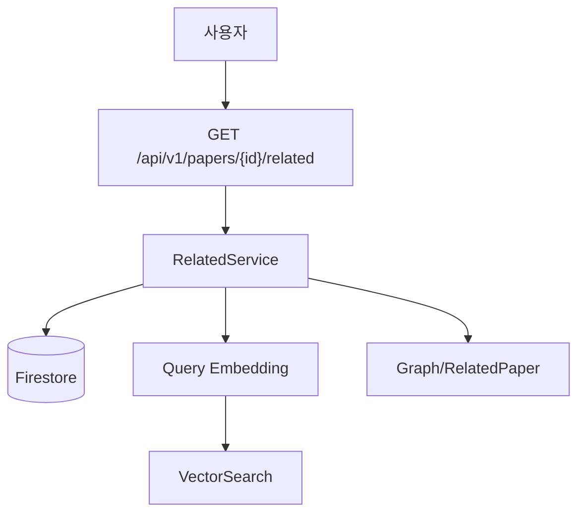

### D-08 Memo & Notes
논문/청크/키워드에 대한 메모를 생성하고 CRUD 기반으로 관리한다.

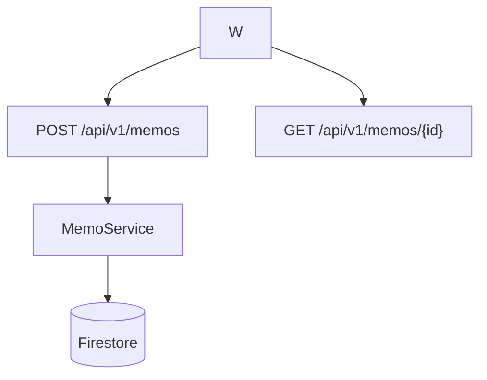

### D-09 Reading Support
PDF 메타 + 청크 조회, 문장/선택 텍스트 기반 해설, 그리고 라이브러리 질의 기반 Q&A를 수행한다.

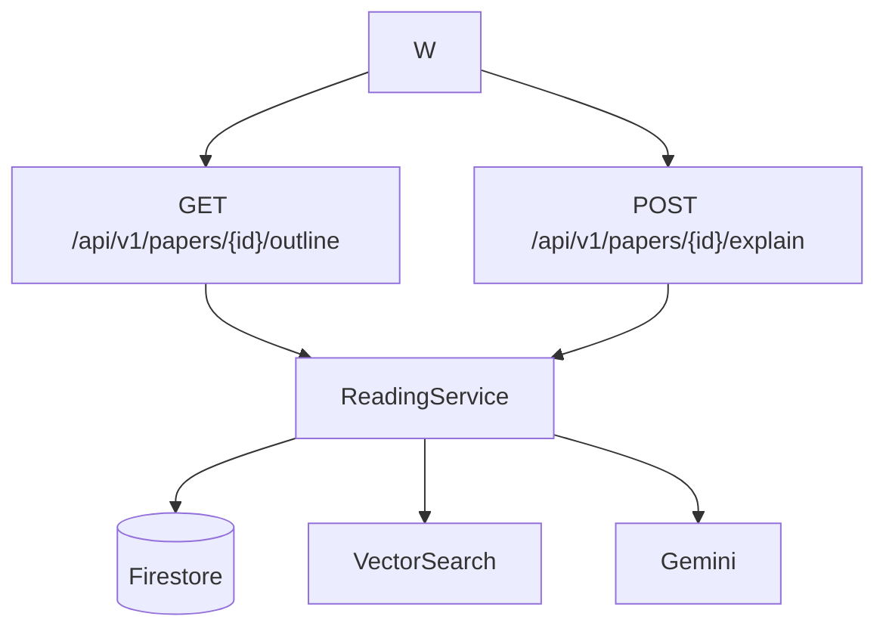

### D-10 TeX & BibTeX
프로젝트 내 TeX 파일(목록/조회/저장/삭제/컴파일/미리보기)을 운영하고, 인용/참조를 텍스트로 다룬다.

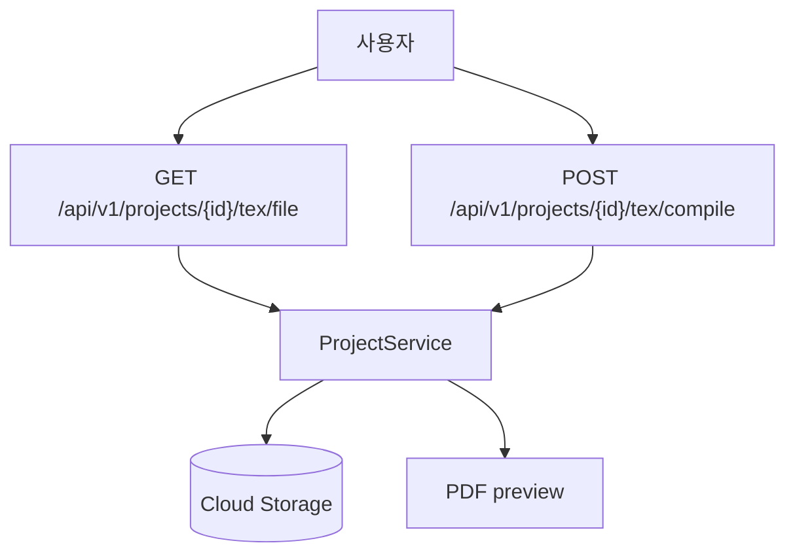

### D-11 Agent
`/api/v1/agent/chat`를 통해 검색/저장/프로젝트/읽기 동작을 하나의 플랜으로 묶어 실행한다.

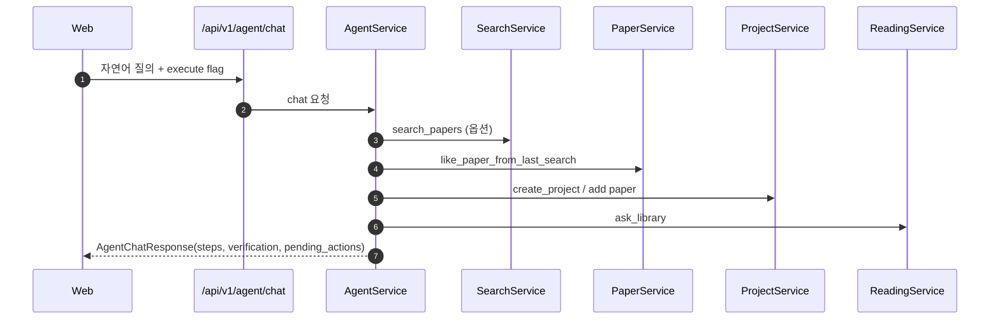

---

## 4. 사용 기술 스택

| 구분 | 기술 | 용도 |
|---|---|---|
| Frontend | Next.js, TypeScript, Tailwind CSS, shadcn/ui | 화면 구성, 인증 연동, 반응형 UI |
| Backend | FastAPI, Pydantic, Firebase Admin SDK | 인증 미들웨어, 도메인 라우트/서비스 구조 |
| Data | Firestore, Cloud Storage | 메타데이터, 라이브러리/메모/키워드 저장, PDF 보관 |
| AI/검색 | Vertex AI Gemini, text-embedding-004, Vertex AI Vector Search | 요약/검색 확장, 문장 해설, 임베딩/유사도 검색 |
| 검색 API | arXiv, PubMed, Scholar(스크래핑) | 외부 논문 소스 수집 |
| 비동기 처리 | Cloud Run Jobs, Python asyncio | PDF 파이프라인 분리 실행 |
| 배포 | Docker, Cloud Run, Cloud Build(운영 파이프라인) | API/Worker 배포 및 관리 |

---

## 5. 사용 API 표 (주요)

### 5.1 인증/프로젝트/논문/도메인 핵심 API

| Domain | Method | Endpoint | 설명 |
|---|---|---|---|
| Auth | GET | `/api/v1/me` | 로그인 사용자 정보 조회 |
| Auth | PATCH | `/api/v1/me` | 프로필/설정 갱신 |
| Search | GET | `/api/v1/search/papers` | 소스 기반 논문 검색 |
| Search | POST | `/api/v1/search/papers/recluster` | 검색 결과 재클러스터(재정렬) |
| Library | GET | `/api/v1/library` | 내 라이브러리 목록 |
| Library | GET | `/api/v1/library/{id}` | 논문 상세 |
| Library | POST | `/api/v1/library/{id}/like` | 논문 좋아요 토글(저장/해제) |
| Library | DELETE | `/api/v1/library/{id}/like` | 좋아요 해제 |
| Library | POST | `/api/v1/library/{id}/upload` | PDF 업로드 + 자동 인제스트 |
| Library | POST | `/api/v1/library/{id}/ingest` | 인제스트 수동 재실행 |
| Project | POST | `/api/v1/projects` | 프로젝트 생성 |
| Project | GET | `/api/v1/projects` | 프로젝트 목록 |
| Project | GET | `/api/v1/projects/{id}` | 프로젝트 상세 |
| Project | PATCH | `/api/v1/projects/{id}` | 프로젝트 수정 |
| Project | DELETE | `/api/v1/projects/{id}` | 프로젝트 삭제 |
| Project | POST | `/api/v1/projects/{id}/papers` | 프로젝트에 논문 추가 |
| Project | DELETE | `/api/v1/projects/{id}/papers/{paperId}` | 프로젝트 논문 제거 |
| Project | GET | `/api/v1/projects/{id}/tex/files` | 프로젝트 TeX 파일 목록 |
| Project | GET | `/api/v1/projects/{id}/tex/file` | TeX 파일 조회 |
| Project | GET | `/api/v1/projects/{id}/tex/file/raw` | TeX 원문 RAW 조회 |
| Project | POST | `/api/v1/projects/{id}/tex/file` | TeX 파일 저장 |
| Project | DELETE | `/api/v1/projects/{id}/tex/file` | TeX 파일 삭제 |
| Project | POST | `/api/v1/projects/{id}/tex/upload` | TeX 리소스 업로드 |
| Project | POST | `/api/v1/projects/{id}/tex/compile` | TeX 컴파일 |
| Project | GET | `/api/v1/projects/{id}/tex/preview` | 컴파일 결과 메타 조회 |
| Project | GET | `/api/v1/projects/{id}/tex/preview/pdf` | 컴파일 PDF 다운로드/조회 |

### 5.2 검색/태깅/읽기/메모/관련도/Agent API

| Domain | Method | Endpoint | 설명 |
|---|---|---|---|
| Keyword | POST | `/api/v1/keywords` | 키워드 생성 |
| Keyword | GET | `/api/v1/keywords` | 키워드 목록 |
| Keyword | PATCH | `/api/v1/keywords/{id}` | 키워드 수정 |
| Keyword | DELETE | `/api/v1/keywords/{id}` | 키워드 삭제 |
| Keyword | POST | `/api/v1/papers/{id}/keywords` | 논문 키워드 수동 태깅 |
| Keyword | GET | `/api/v1/papers/{id}/keywords` | 논문 키워드 목록 |
| Keyword | DELETE | `/api/v1/papers/{id}/keywords/{keywordId}` | 논문 키워드 제거 |
| Keyword | POST | `/api/v1/papers/{id}/keywords/suggest` | 키워드 자동 추천 적용 |
| Related | GET | `/api/v1/papers/{id}/related` | 관련 논문 추천 |
| Related | GET | `/api/v1/projects/{projectId}/graph` | 프로젝트 관련도 그래프 |
| Related | GET | `/api/v1/graph` | 전역 그래프 |
| Keyword Related | GET | `/api/v1/papers/{id}/library-related-by-keywords` | 키워드 기반 라이브러리 추천 |
| Reading | GET | `/api/v1/papers/{id}/outline` | 논문 아웃라인 조회 |
| Reading | GET | `/api/v1/papers/{id}/chunks` | 청크 목록 조회 |
| Reading | POST | `/api/v1/papers/{id}/explain` | 문장/선택 텍스트 해설 |
| Reading | POST | `/api/v1/papers/{id}/highlights` | 하이라이트 저장 |
| Reading | GET | `/api/v1/papers/{id}/highlights` | 하이라이트 목록 |
| Reading | POST | `/api/v1/library/ask` | 라이브러리 Q&A |
| Memo | GET | `/api/v1/memos` | 메모 목록 |
| Memo | POST | `/api/v1/memos` | 메모 생성 |
| Memo | GET | `/api/v1/memos/{id}` | 메모 상세 |
| Memo | PATCH | `/api/v1/memos/{id}` | 메모 수정 |
| Memo | DELETE | `/api/v1/memos/{id}` | 메모 삭제 |
| Agent | POST | `/api/v1/agent/chat` | 검색/저장/프로젝트/요약 플로우 실행 |

---

## 6. 마무리

이 문서는 블로그 포스트 본문 초안으로 바로 사용할 수 있도록 “구조 + 도메인 로직 + 실행 API”를 한데 묶었다.  
현재 기준으로는 **Pub/Sub 미사용, API 기반 Cloud Run Job 직접 트리거**가 핵심 운영 가정이므로, 아키텍처 설명에서도 해당 포인트를 명시적으로 부각시키는 것이 중요하다.
