# 프로젝트 서비스 구조 및 서비스 도메인별 기능서 (Web + Google Cloud)

## 1. 문서 목적
이 문서는 **Miro에서 정의한 사용자 플로우**를 기반으로, 협업 개발을 위해 다음을 표준화한다.

- 서비스(도메인) 단위로 시스템을 분해하고 책임 경계를 정의
- 각 도메인별 기능 범위, 주요 유스케이스, 데이터(엔티티), 권한, 비동기 파이프라인을 명확화
- 팀원이 “여기서부터 만들면 된다”로 바로 착수할 수 있도록 API/작업 단위를 설계

> 전제: Web 서비스이며 Google Cloud 사용이 필수. 장시간 처리는 비동기 파이프라인으로 분리.

---

## 2. 서비스 개요 (Miro 기반 기능 요약)
사용자는 논문을 검색/저장하고, 키워드 및 메모로 지식을 구조화하며, 관련 논문 그래프를 통해 연구를 확장한다. 또한 **내가 작성 중인 논문(=My Paper 프로젝트)** 을 생성하고, 저장해둔 참조 논문/관련 연구를 연결해 관리한다. PDF 읽기 지원(구문/문장 단위 하이라이트, 섹션/세그먼트 탐색)과 TeX 편집 및 BibTeX export까지 하나의 워크플로우로 제공한다.

### 2.1 대표 사용자 플로우 (요구사항 반영)

#### 플로우 A: 검색 → 저장(いいね) → 메모 → 관련연구 선택 → My Paper 프로젝트 생성
1) **Search**: 검색어 입력 → 논문 결과 리스트
2) **Save(いいね)**: 결과에서 “いいね”로 내 라이브러리(My Paper Library)에 저장
3) **Memo**: 저장된 논문에 대해 **메모를 생성/저장(자동 또는 최소 입력)** 하고, 사용자는 즉시 이동하지 않아도 된다. 이후 **Memo 화면에서 체크/편집/정리**가 가능하다(요약/생각/근거).
4) **Related**: 해당 논문의 관련 연구(추천/그래프/리스트)에서 유의미한 논문을 선택
5) **Create My Paper Project**: 선택된 참조 논문 묶음을 기반으로 **새 ‘내 논문 프로젝트(My Paper)’** 를 생성
6) **Manage**: 생성된 My Paper 프로젝트는 My Paper에서 지속적으로 관리(참조 추가/제거, 키워드, 메모 연결)

#### 플로우 B: 내 프로젝트(My Paper) → 내 논문과 관련/참조 논문 확인
1) **My Paper 목록**에서 작성 중인 내 논문 프로젝트를 선택
2) **내 논문 개요/섹션**과 연결된 **참조 논문 리스트** 확인
3) 프로젝트 관점에서 **관련(Connected) 논문/그래프**를 확인하고 부족한 관련 연구를 추가
4) 필요 시 TeX/BibTeX export로 작성 워크플로우에 반영

> 용어 정리
- **My Paper Library**: 내가 “いいね”로 저장한 외부 논문 저장소(읽기/메모/태깅 대상)
- **My Paper 프로젝트(내 논문 프로젝트)**: 내가 작성 중인 논문(프로젝트) 컨테이너. 참조 논문/메모/키워드를 묶어 관리


---

## 3. 시스템 아키텍처 (GCP 기준)

### 3.0 프론트엔드 UI 원칙 (shadcn/ui)
- 컴포넌트는 shadcn/ui를 기본으로 사용하고, 커스텀은 `components/ui`(shadcn)와 `components/common`(서비스 공통)로 분리한다.
- 스타일은 Tailwind를 기본으로 하며, 화면별 스타일은 최대한 컴포넌트로 캡슐화한다.
- 상태 표현(로딩/에러/빈 상태)은 모든 화면에서 일관된 UI 패턴을 사용한다(Toast, Skeleton, EmptyState).
- 접근성(키보드 포커스/aria)과 반응형(모바일~데스크톱)을 기본 요구사항으로 둔다.


### 3.1 구성 요소
- Frontend(Web)
  - **Next.js(TypeScript) 권장**
  - UI: **shadcn/ui + Tailwind CSS**
  - 배포: Cloud Run(SSR 필요 시) 또는 Firebase Hosting(정적) + API 분리

- Backend(API)
  - Docker 컨테이너로 배포되는 **FastAPI** 기반 단일 API 또는 도메인별 모듈형 모놀리식(권장)
  - 인증: Firebase Auth(또는 Identity Platform)

- Data Layer
  - Firestore: 사용자/프로젝트/논문 메타데이터/메모/키워드/관계 그래프
  - Cloud Storage: PDF 원본 및 파싱 산출물(JSON, 텍스트)

- AI/검색
  - Vertex AI: Gemini(요약/키워드 판단/문장 해석), Embeddings
  - Vertex AI Vector Search: 논문/문단/키워드 유사도 검색

- 비동기 파이프라인
  - Cloud Run Jobs(또는 Cloud Tasks): PDF 파싱/청크/임베딩/인덱싱
  - 현재 구현 기준: `Pub/Sub`는 소비형 트리거로 사용하지 않고 API에서 Job을 직접 실행

### 3.2 데이터 흐름(요약)
- 논문 저장/업로드
  1) Web → API: paper 저장 요청
  2) API → GCS: PDF 저장
  3) API → Cloud Run Jobs(`execute_ingest_job`) 실행
  4) Job → PDF 파싱/섹션화/청크화
  5) Job → Vertex Embedding 생성
  6) Job → Vector Search 인덱스 업서트
  7) Job → Firestore: 상태 업데이트(READY)

### 3.2.1 클라우드 아키텍처 Mermaid

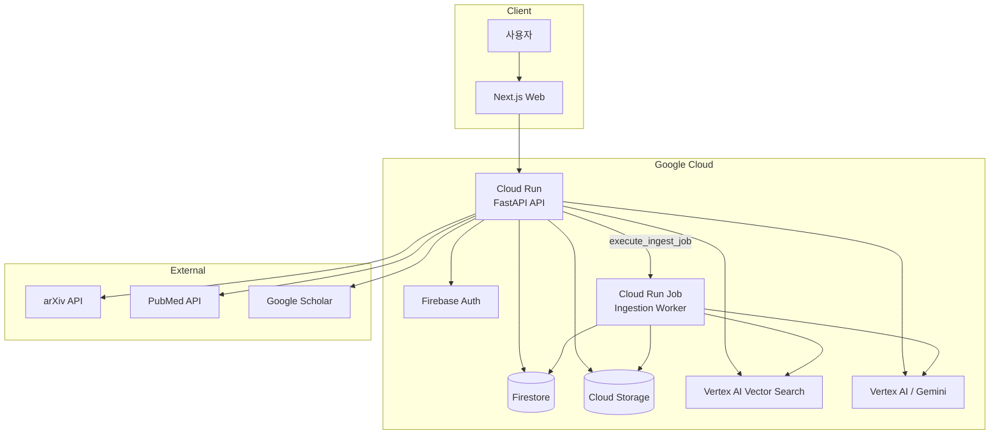

### 3.3 권한 모델(기본)
- 모든 사용자 데이터는 `ownerUid` 기준으로 접근 제어
- 프로젝트 내 공유가 필요하면 `projectMembers[]` 또는 `acl`을 확장(추후)

### 3.4 배포 설계 (Docker + Cloud Run)
본 프로젝트는 **FastAPI를 Docker 이미지로 패키징**하고, 이를 **Cloud Run**에 배포한다. 파이프라인은 Cloud Run Jobs(또는 Cloud Tasks/Workflows)로 분리 배포한다.

#### 3.4.1 배포 단위
- **API Service (Cloud Run Service)**
  - 외부에서 호출되는 REST API
  - Firebase Auth(JWT) 검증 미들웨어 포함
  - Firestore / Cloud Storage / Vertex AI / Cloud Run Jobs 접근

- **Pipeline Worker (Cloud Run Jobs)**
  - PDF 파싱/청크/임베딩/인덱싱 수행
  - 트리거: 현재는 API에서 Job 실행 요청, 필요 시 Pub/Sub 이벤트로 확장

- (선택) **Web Frontend (Cloud Run 또는 Firebase Hosting)**
  - SSR 필요 시 Cloud Run(Next.js)
  - 정적 배포면 Firebase Hosting 권장

#### 3.4.2 FastAPI 컨테이너(권장 런타임)
- 프로세스: `uvicorn`(또는 gunicorn+uvicorn worker)
- Health endpoint: `/health` (인증 없이 200)
- 기본 포트: Cloud Run이 제공하는 `PORT` 환경변수 사용

#### 3.4.3 (예시) Dockerfile/실행 정책 (문서용 스펙)
- 베이스: Python slim
- `uvicorn app.main:app --host 0.0.0.0 --port $PORT`
- 멀티스테이지는 선택(빌드 최적화)

> 코드는 이 문서에 포함하지 않고, 레포 `apps/api/Dockerfile`로 관리한다.

#### 3.4.4 Cloud Run 배포 파라미터(권장)
- CPU/메모리: API(1 vCPU / 512MB~1GB), Worker(2 vCPU / 2~4GB)
- Concurrency: API는 20~80 범위(검증/부하로 조정), Worker Job은 1(권장)
- Min instances: 개발 0, 운영은 콜드스타트 허용 여부에 따라 0~1
- Timeout: API 30~60s, Worker Job은 10~30m(작업 특성에 맞춤)

#### 3.4.5 환경변수(권장 키)
- 일반 환경변수
  - `GCP_PROJECT_ID`
  - `GCP_REGION`
  - `FIRESTORE_DB` (기본은 default)
  - `GCS_BUCKET_PDF`
  - `CLOUD_RUN_JOB_NAME`
  - `PUBSUB_TOPIC_INGEST` (현재 미사용 / 이벤트 확장용)
  - `VERTEX_LOCATION`
  - `VECTOR_INDEX_ID`
  - `VECTOR_INDEX_ENDPOINT_ID`
  - `CORS_ALLOW_ORIGINS`
  - `RUN_INGEST_LOCALLY`

- 민감 설정은 운영 정책에 맞춰 환경변수 또는 시크릿 솔루션에서 안전하게 주입(현재 구성은 기본 환경변수 기준)

#### 3.4.6 서비스 계정/IAM(최소 권한 권장)
Cloud Run Service 및 Job에 전용 서비스 계정을 부여한다.
- Firestore 접근: `roles/datastore.user`
- Cloud Storage 접근: `roles/storage.objectAdmin`(개발) → 운영은 최소권한으로 축소
- Pub/Sub 발행: `roles/pubsub.publisher` (현재는 미사용, 이벤트 아키텍처 확장용)
- Vertex AI 호출: `roles/aiplatform.user`
- (Job 실행을 API에서 트리거한다면) Run 권한: `roles/run.invoker` 또는 `roles/run.developer`(운영 정책에 따라)

#### 3.4.7 파이프라인 트리거(현재 구현)
- 현재는 **(B) API가 Job 실행**만 운영 중:
  - `execute_ingest_job(paper_id, owner_uid, request_id, pdf_url)`로 Job 호출
  - Cloud Run Jobs에 `PAPER_ID`, `OWNER_UID`, `REQUEST_ID`, `PDF_URL`를 환경변수로 전달
- 자동 트리거 경로
  - `POST /api/v1/library/{id}/like` (논문 메타에 `pdf_url`이 있으면 auto ingest)
  - `POST /api/v1/library/{id}/upload` (업로드 직후)
- 수동 트리거 경로
  - `POST /api/v1/library/{id}/ingest` (이미 PDF가 GCS에 있는 전제)
- Pub/Sub(`paper.ingest.requested`)는 환경설정/요구사항 문서에 남아 있을 수 있으나, 현재는 실시간 소비 트리거로 동작하지 않음

#### 3.4.8 관측/운영
- Error Reporting/Alerting: 파이프라인 실패율, Job 실패 알림(운영 연동 필요 시)
- Trace(선택): API latency 병목 분석


---

## 4. 서비스 도메인 분해(책임 경계)
본 프로젝트는 다음 도메인으로 분해한다.

| 도메인 ID | 도메인명 | 책임(한 줄) |
|---|---|---|
| D-01 | Auth & User | 로그인, 사용자 프로필, 권한/세션 |
| D-02 | Project (My Paper 프로젝트) | **내 논문 프로젝트** 생성/관리, 참조 논문 묶음, export 정책 |
| D-03 | Paper Library (My Paper Library) | 검색 결과를 **いいね(Like)** 로 저장, 내 라이브러리 관리(상태/메타데이터) |
| D-04 | Paper Search | 외부 소스 검색(arXiv 등), 결과 정규화 |
| D-05 | Ingestion Pipeline | PDF 파싱/청크/임베딩/인덱싱(비동기) |
| D-06 | Keyword & Tagging | 키워드 생성/편집, 자동 태깅/판단 |
| D-07 | Related Graph | 논문 간 연관도, connected papers 그래프 |
| D-08 | Memo & Notes | 메모/요약/인용 근거, 링크/참조 |
| D-09 | Reading Support | PDF 뷰어, 섹션/세그먼트, 하이라이트 |
| D-10 | TeX & BibTeX | TeX 편집, 인용 관리, BibTeX export |
| D-11 | Agent | /agent/chat 작업형 에이전트 (검색/저장/프로젝트/라이브러리 질의) |

> 구현 방식: 초기에는 **모듈형 모놀리식 API(Cloud Run 1개)**로 시작하고, 파이프라인 Job만 분리. 성장 시 도메인별 서비스 분리.

---

## 5. 도메인별 기능서

아래는 도메인별로 “무엇을 만들고”, “데이터는 무엇이며”, “API/작업은 어떻게 나뉘는지”를 명시한다.

### 5.0 도메인/플로우 Mermaid 한눈에 보기

1) 전체 아키텍처

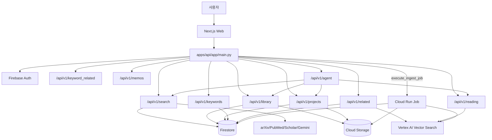

2) 핵심 실행 흐름

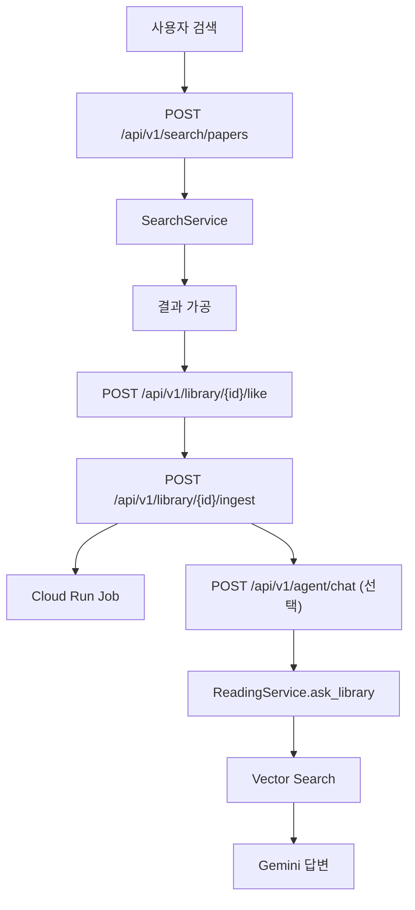

### D-01 Auth & User

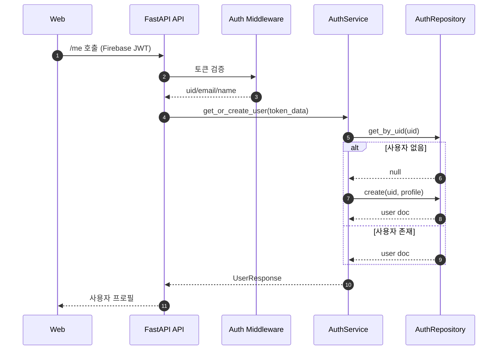

#### 5.1.1 범위
- Firebase Auth 기반 로그인/세션
- 사용자 프로필(기본 정보, 설정)

#### 5.1.2 핵심 기능
- F-0101 로그인/회원가입(Email/OAuth)
- F-0102 프로필 조회/수정(표시명, 연구분야 태그 등)
- F-0103 권한 검사(서버 미들웨어)

#### 5.1.3 주요 엔티티(예시)
- `User`(uid, email, display_name, created_at, preferences)

#### 5.1.4 API(초안)
- `GET /api/v1/me`
- `PATCH /api/v1/me`

#### 5.1.5 비고
- 프로젝트 공유 기능은 1차 MVP에서는 제외(소유자만)

---

### D-02 Project (My Paper 프로젝트)

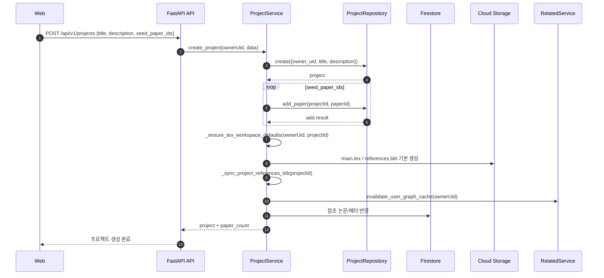

#### 5.2.1 범위
- **내 논문 프로젝트(My Paper 프로젝트)** 생성/관리
- 프로젝트에 참조 논문(외부 논문)을 추가/제거
- 프로젝트 단위로 export/bibtex 구성
- (옵션) 선택된 관련 연구 세트로 프로젝트를 빠르게 생성

#### 5.2.2 핵심 기능
- F-0201 프로젝트 생성/수정/삭제
- F-0202 프로젝트에 참조 논문 추가/제거
- F-0203 프로젝트 대시보드(진행도, 최근 활동)
- F-0204 프로젝트 export(bibtex + 주석)
- F-0205 관련연구 선택 세트로 My Paper 프로젝트 생성(Seed papers)
- F-0206 프로젝트 상세에서 **참조 논문/관련 논문(Connected)** 을 확인하고 추가

> 정책(권장)
- 프로젝트에 논문을 추가하려면 해당 논문이 My Paper Library에 존재해야 한다.
- 사용자가 검색 결과/관련 연구에서 프로젝트로 추가하는 경우, 서버는 필요 시 해당 논문을 **자동으로 Library에 저장(いいね와 동일 저장소)** 한 뒤 프로젝트에 연결한다.

#### 5.2.3 주요 엔티티
- `Project`(id, ownerUid, title, description, createdAt)
- `ProjectPaper`(projectId, paperId, addedAt, note)

#### 5.2.4 API(초안)
- `POST /api/v1/projects`
- `GET /api/v1/projects`
- `GET /api/v1/projects/:id`
- `PATCH /api/v1/projects/:id`
- `DELETE /api/v1/projects/:id`
- `POST /api/v1/projects/:id/papers`
- `DELETE /api/v1/projects/:id/papers/:paperId`
- `GET /api/v1/projects/:id/papers`
- `GET /api/v1/projects/:id/tex/files`
- `GET /api/v1/projects/:id/tex/file?path=main.tex`
- `GET /api/v1/projects/:id/tex/file/raw?path=...`
- `POST /api/v1/projects/:id/tex/file`
- `POST /api/v1/projects/:id/tex/upload`
- `DELETE /api/v1/projects/:id/tex/file?path=...`
- `POST /api/v1/projects/:id/tex/compile`
- `GET /api/v1/projects/:id/tex/preview`
- `GET /api/v1/projects/:id/tex/preview/pdf`

#### 5.2.5 권한
- ownerUid만 접근(추후 멤버 확장)

---

### D-03 Paper Library (My Paper Library: いいね 저장소)

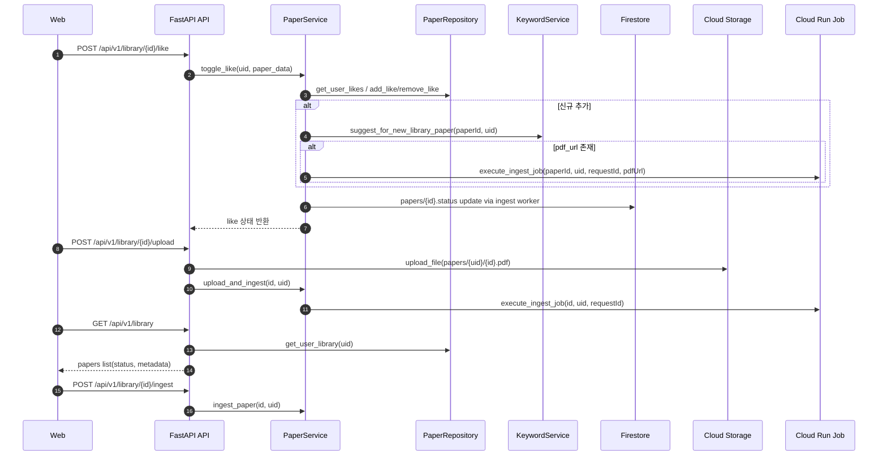

#### 5.3.1 범위
- 검색 결과/논문 상세에서 **いいね(Like)** 로 저장한 논문 목록
- 저장/해제(좋아요 토글), 필터/정렬
- 논문 상태 관리(INGESTING, READY, FAILED)

#### 5.3.2 핵심 기능
- F-0301 논문 저장(메타데이터 기반)
- F-0302 PDF 업로드/링크 등록
- F-0303 내 라이브러리 조회/정렬/필터
- F-0304 논문 상세 페이지(메타데이터, 키워드, 메모, 관련 논문)
- F-0305 いいね 저장 → **메모 자동 생성/저장**(나중에 Memo 화면에서 체크/편집)

#### 5.3.3 주요 엔티티
- `Paper`(id, ownerUid, title, authors, year, venue, doi/arxivId, abstract, pdfUrl, status)
- `Like`(paperId, ownerUid, createdAt)  // UI 표기는 いいね

#### 5.3.4 API(초안)
- `GET /api/v1/library`
- `GET /api/v1/library/:id`
- `POST /api/v1/library/:id/upload` (PDF 업로드)
- `POST /api/v1/library/:id/ingest` (수동 인제스트)
- `POST /api/v1/library/:id/like`
- `DELETE /api/v1/library/:id/like`

#### 5.3.5 비동기 연동
- PDF 업로드/like 자동 트리거 시 `execute_ingest_job` 호출로 D-05 파이프라인 수행
- 수동 `ingest`는 Storage에 파일이 있으면 직접 호출

---

### D-04 Paper Search

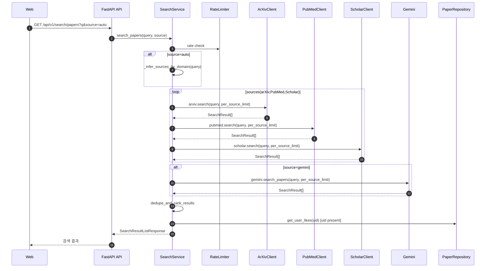

#### 5.4.1 범위
- 외부 논문 검색(arXiv, PubMed, Google Scholar 스크래핑 기반)
- 검색 결과 정규화(내부 Paper 스키마로 매핑)

#### 5.4.2 핵심 기능
- F-0401 키워드 검색
- F-0402 필터(연도/저널/저자)
- F-0403 검색 결과에서 저장(My Paper로 import)

#### 5.4.3 API(초안)
  - `GET /api/v1/search/papers?q=&source={auto|all|arxiv|pubmed|scholar|gemini}&limit&offset`
  - `POST /api/v1/search/papers/recluster`

#### 5.4.4 구현 노트
- RateLimiter: arXiv/PubMed/Scholar에 `FirestoreRateLimiter`로 호출 간격 제어
- 캐시: 외부 클라이언트 레벨의 임시 캐시(항목별 TTL) 존재 가능

---

### D-05 Ingestion Pipeline (Async)

```mermaid
sequenceDiagram
  autonumber
  participant API as FastAPI API
  participant JOB as Cloud Run Job
  participant W as Worker Main
  participant ING as IngestService
  participant ST as CloudStorage
  participant PAR as PDFParser
  participant CH as Chunker
  participant EMB as Embedder
  participant IDX as Indexer
  participant DB as Firestore
  participant VS as VectorSearch

  API->>JOB: execute_ingest_job(paperId, ownerUid, requestId, pdfUrl)
  JOB->>W: run_worker(paperId, ownerUid, requestId, pdfUrl)
  W->>ING: run_ingest(paperId, ownerUid, requestId, pdfUrl)
  ING->>DB: update paper status=INGESTING

  alt pdfUrl exists
    ING->>ST: ensure_pdf_in_storage("papers/{uid}/{paperId}.pdf")
  end

  ING->>PAR: parse_pdf(paperId, storagePath)
  PAR->>ST: download PDF
  ST-->>PAR: PDF bytes
  PAR-->>ING: pages_data

  ING->>CH: create_chunks(pages_data)
  CH-->>ING: chunks

  ING->>EMB: generate_embeddings(chunks)
  EMB-->>ING: chunks + embedding vectors

  ING->>IDX: upsert_index(chunks, paperId, ownerUid)
  IDX->>VS: upsert_datapoints(restricts)
  VS-->>IDX: index update

  loop each chunk
    ING->>DB: save chunks/{chunkId} (text, pageNumber, tokenCount, updatedAt)
  end

  ING->>DB: update paper status=READY
  alt failure
    ING->>DB: update paper status=FAILED, error
  end
```

#### 5.5.1 범위
- PDF → 텍스트 추출 → 섹션 분할 → 청크 생성
- 임베딩 생성(Vertex Embeddings)
- Vector Search 인덱스 업서트

#### 5.5.2 핵심 기능
- F-0501 파이프라인 트리거(API -> Cloud Run Job)
- F-0502 PDF 파싱 및 섹션 구조화
- F-0503 청크/메타(섹션, 페이지, 오프셋) 생성
- F-0504 임베딩 생성 및 인덱싱
- F-0505 상태 업데이트(READY/FAILED)

#### 5.5.3 주요 엔티티
- `Paper`(id, status, createdAt/updatedAt, startedAt/lastRequestId, error)
- `PaperChunk`(paperId, chunkId, text, pageNumber, tokenCount, start_char_idx, end_char_idx)
  - `start_char_idx/end_char_idx`는 `chunker.py` 단계에서 산출되나 `Firestore chunks` 저장 시 필수 필드로는 사용 안 함.

#### 5.5.4 이벤트
- `paper.ingest.requested / paper.ingest.completed / paper.ingest.failed`
  - 현재는 이벤트 브로커 소비형 파이프라인이 아니라 `Cloud Run Job` 직접 실행 방식.
  - 이벤트명은 향후 확장 시나리오용 표기로 유지.

#### 5.5.5 실패/재시도 정책
- 실행 중 예외 발생 시 `status=FAILED`로 즉시 반영하고 실패 사유를 저장
- 현재 단계에서는 내부 자동 재시도 루프 없이, 운영자가 `POST /api/v1/library/{id}/ingest`로 수동 재시도

---

### D-06 Keyword & Tagging

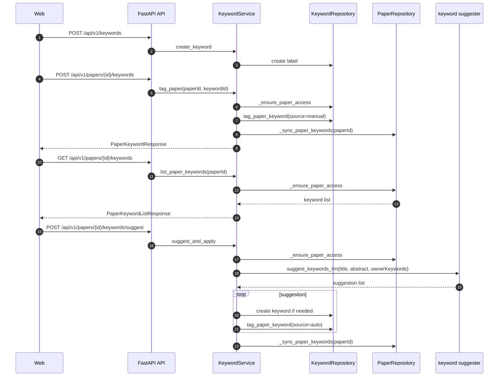

#### 5.6.1 범위
- 키워드(사용자 정의 + 자동 추천)
- 논문에 키워드 부착
- 키워드로 관련 논문/문단 검색

#### 5.6.2 핵심 기능
- F-0601 키워드 생성/수정/삭제
- F-0602 논문 키워드 태깅
- F-0603 자동 키워드 추천(LLM/임베딩 기반)
- F-0604 키워드의 “적합성 판단”(이 키워드가 논문에 해당하는가)

#### 5.6.3 주요 엔티티
- `Keyword`(id, ownerUid, label, description, createdAt)
- `PaperKeyword`(paperId, keywordId, confidence, source=manual/auto)

#### 5.6.4 API(초안)
- `POST /api/v1/keywords`
- `GET /api/v1/keywords`
- `PATCH /api/v1/keywords/:id`
- `DELETE /api/v1/keywords/:id`
- `POST /api/v1/papers/:id/keywords`
- `GET /api/v1/papers/:id/keywords`
- `DELETE /api/v1/papers/:id/keywords/:keywordId`
- `POST /api/v1/papers/:id/keywords/suggest`

---

### D-07 Related Graph (Connected Papers)

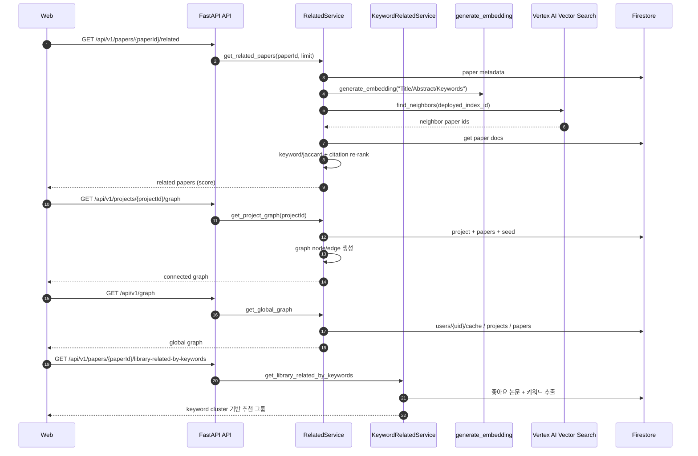

#### 5.7.1 범위
- 논문 간 연관도 계산
- 그래프 UI에 필요한 노드/엣지 제공
- (지원) 관련 연구에서 선택한 논문을 프로젝트의 참조로 연결

#### 5.7.2 핵심 기능
- F-0701 관련 논문 추천(벡터 유사도 + 키워드 공유 + 인용 메타)
- F-0702 그래프 데이터 생성/조회
- F-0703 사용자가 선택한 기준에 따른 그래프 재구성(키워드 중심/논문 중심)
- F-0704 관련 연구 선택 → 프로젝트 참조로 추가(선택 리스트 기반)

#### 5.7.3 주요 엔티티
- `GraphData`(nodes, edges)
  - `Node`(id, label, group, val)
  - `Edge`(source, target, value)
- `RelatedPaper`(paperId, title, authors, year, venue, abstract, similarity, citationCount)

#### 5.7.4 API(초안)
- `GET /api/v1/papers/:id/related`
- `GET /api/v1/projects/:id/graph`
- `GET /api/v1/graph`
- `POST /api/v1/projects/:id/papers` (paperId 또는 외부 식별자) // 관련 연구 선택을 참조로 추가
- `GET /api/v1/papers/:id/library-related-by-keywords`

> 구현 메모
- UI에서 관련 논문을 여러 개 선택한 뒤, `POST /api/v1/projects`(seedPaperIds[]) 또는 `POST /api/v1/projects/:id/papers`를 반복 호출해 연결한다.


#### 5.7.5 구현 노트
- 1차는 on-demand(요청 시 계산/캐시)
- 2차는 이벤트 파이프라인(`paper.ingest.completed`) 기반 사전 계산으로 확장 가능(현재는 API 직접 실행 경로 중심)

---

### D-08 Memo & Notes

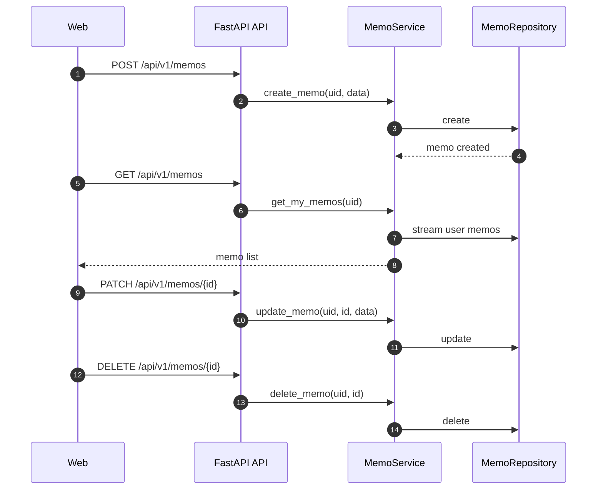

#### 5.8.1 범위
- 메모 작성/검색
- 논문/키워드/문단(chunk) 단위로 참조 연결
- “왜 인용했는지” 근거 기록

#### 5.8.2 핵심 기능
- F-0801 메모 CRUD
- F-0802 메모를 특정 Paper/Chunk/Keyword에 연결
- F-0803 메모 검색(키워드/논문 기반)

#### 5.8.3 주요 엔티티
- `Memo`(id, ownerUid, title, body, createdAt, updatedAt)
- `MemoRef`(memoId, refType=paper/project/chunk/keyword, refId)

#### 5.8.4 API(초안)
- `POST /api/v1/memos`
- `GET /api/v1/memos`
- `GET /api/v1/memos/:id`
- `PATCH /api/v1/memos/:id`
- `DELETE /api/v1/memos/:id`

---

### D-09 Reading Support

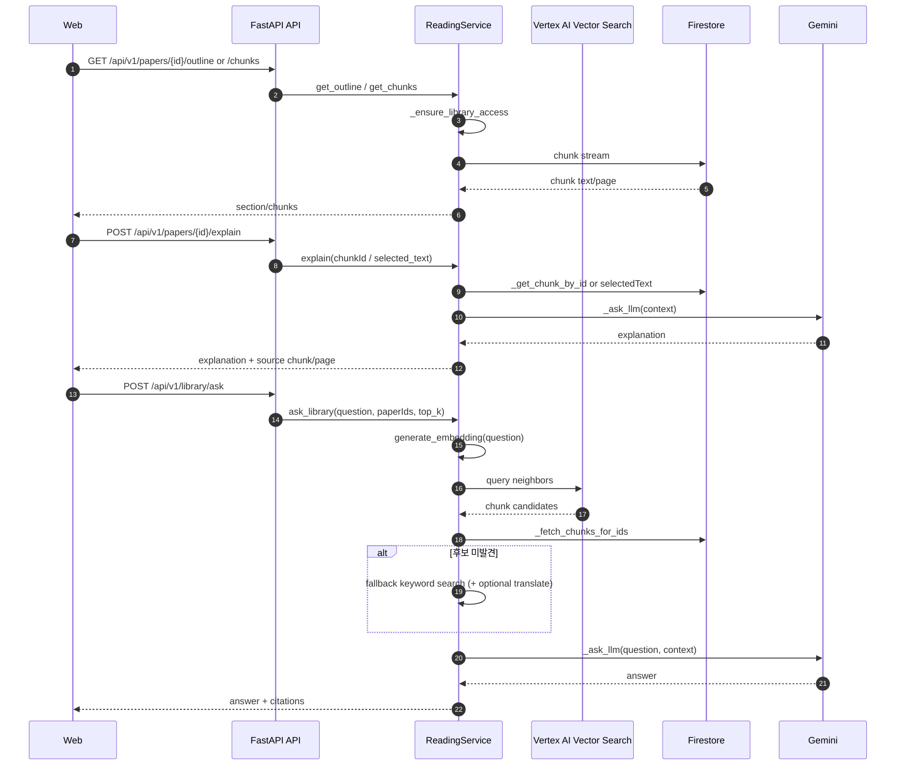

#### 5.9.1 범위
- PDF 뷰어
- 섹션/세그먼트(예: 100 단위 분할) 탐색
- 문장/구문 기반 하이라이트(LLM 출력은 근거 링크 필수)

#### 5.9.2 핵심 기능
- F-0901 PDF 렌더링(웹)
- F-0902 섹션/세그먼트 네비게이션
- F-0903 문장 해석/하이라이트(선택 텍스트 기반)
- F-0904 근거(원문 위치, chunk id) 첨부

#### 5.9.3 주요 엔티티
- `Highlight`(id, ownerUid, paperId, chunkId, textSpan, note, createdAt)

#### 5.9.4 API(초안)
- `GET /api/v1/papers/:id/outline`
- `GET /api/v1/papers/:id/chunks?section=`
- `POST /api/v1/papers/:id/explain` (selectedText or chunkId)
- `POST /api/v1/papers/:id/highlights`
- `GET /api/v1/papers/:id/highlights`

#### 5.9.5 안전장치
- LLM 응답은 반드시 `sourceChunkId` 또는 `pageRange` 등 **근거를 함께 반환**

---

### D-10 TeX & BibTeX

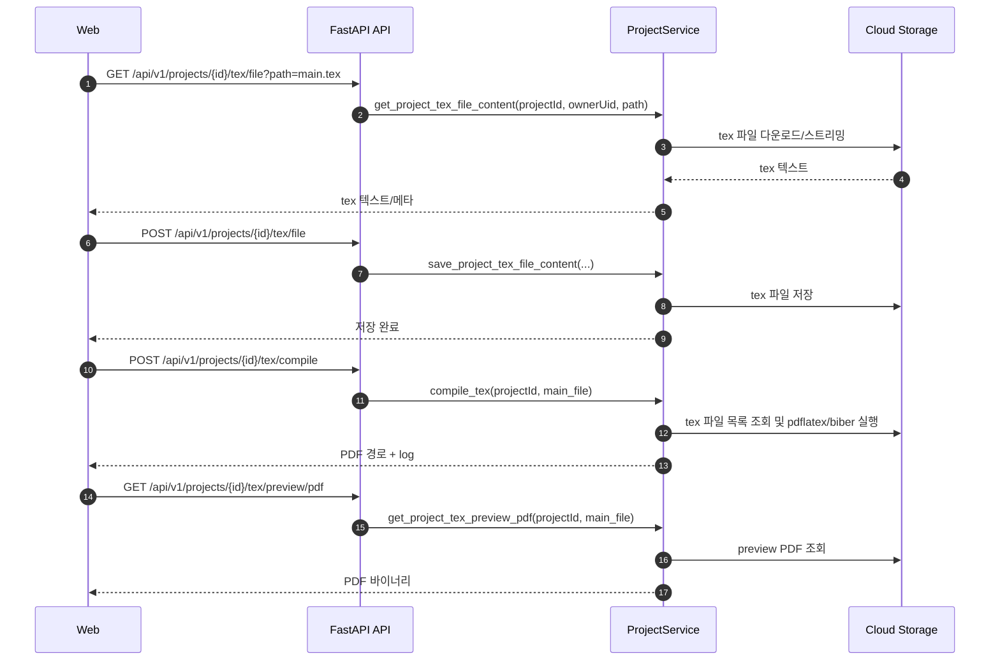

#### 5.10.1 범위
- TeX 에디터(또는 텍스트 편집 UI)
- 프로젝트/논문 기반 BibTeX export
- 인용 주석(왜 이 논문을 인용했는지) 함께 관리
- `references.bib` 동기화 + `main.tex`/라이브러리 bib 구성

#### 5.10.2 핵심 기능
- F-1001 TeX 문서 생성/저장
- F-1003 references.bib 자동 생성/동기화
- F-1001(프로젝트 기준): `/projects/{id}/tex/file`, `compile`, `preview` 플로우
- F-1002 논문을 TeX에 인용 추가/관리: `미구현(별도 TeX 문서 라우트 stub)`
- F-1004 BibTeX 항목 주석/근거 관리: `미구현(별도 TeX 문서 라우트 stub)`

#### 5.10.3 주요 엔티티
- `ProjectTexFile`(projectId, ownerUid, path, contentType, updatedAt)

#### 5.10.4 API(초안)
- `GET /api/v1/projects/:id/tex/files`
- `GET /api/v1/projects/:id/tex/file?path=...`
- `GET /api/v1/projects/:id/tex/file/raw?path=...`
- `POST /api/v1/projects/:id/tex/file`
- `DELETE /api/v1/projects/:id/tex/file?path=...`
- `POST /api/v1/projects/:id/tex/upload` (이미지/그림 등 리소스 업로드)
- `POST /api/v1/projects/:id/tex/compile`
- `GET /api/v1/projects/:id/tex/preview`
- `GET /api/v1/projects/:id/tex/preview/pdf`

#### 5.10.5 현재 구현 상태
- 구현 완료: `projects` 라우터의 TeX 파일 관리/컴파일/미리보기
- 미구현(TODO): `apps/api/app/modules/tex/router.py`의 `POST/GET/PATCH /texdocs`, `POST /texdocs/{id}/citations`
- 운영 주의: `/texdocs`는 현재 `apps/api/app/main.py`에서 마운트되지 않음

---

### D-11 Agent

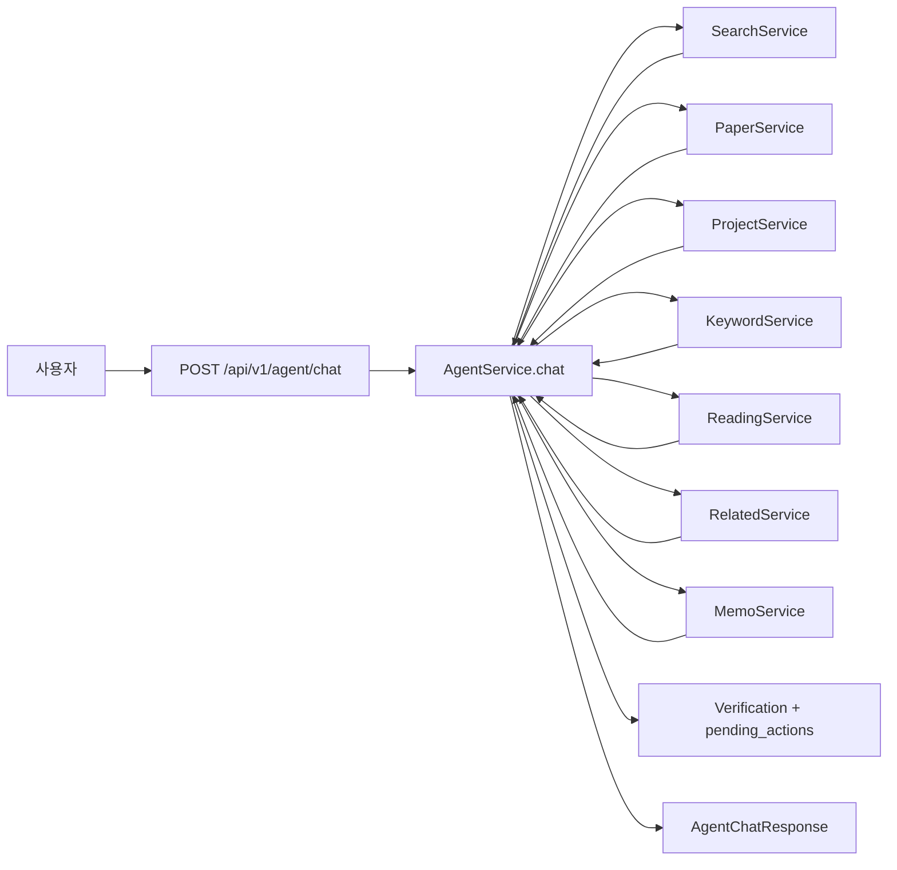

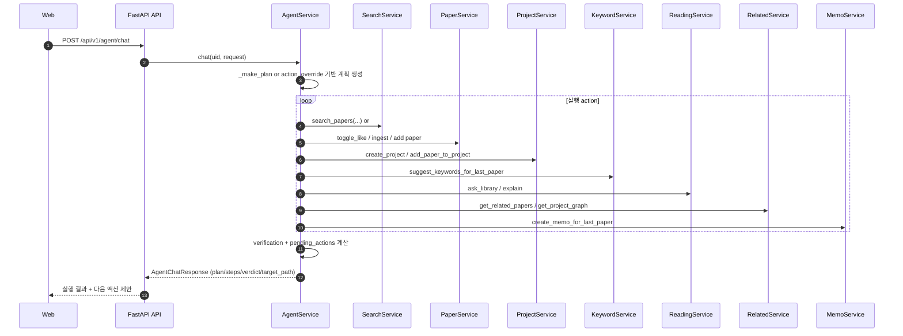

#### 5.11.1 범위
- 사용자 질의 기반 작업 플래닝(검색, 저장, 프로젝트, 키워드, 메모, 읽기요약의 연동)

#### 5.11.2 핵심 기능
- F-1101 멀티스텝 plan 생성
- F-1102 명시 action 실행(검색/좋아요/프로젝트/메모/관련연구)
- F-1103 실행 이력(step)과 검증(verification) 반환
- F-1104 실패 시 pending_actions 제안

#### 5.11.3 주요 엔티티
- `AgentChatRequest`(message, history, execute, context, actions_override)
- `AgentChatResponse`(reply, plan, steps, verification, pending_actions)

#### 5.11.4 API(초안)
- `POST /api/v1/agent/chat`

#### 5.11.5 구현 노트
- `actions_override`가 있으면 LLM 플래닝을 우회해 수동 플랜 실행
- 실행되지 않은 액션은 `pending_actions`로 반환되며 사용자 다음 실행 트리거에 사용 가능

---

### 구현 정합성 점검 (문서-코드)

- `D-03`, `D-04`, `D-06`, `D-07`, `D-08`, `D-09`, `D-11`의 API 경로는 `/api/v1` 프리픽스 기준으로 문서화되었고, 실제 라우팅 설정(`main.py`)과 일치합니다.
- `D-05`는 Pub/Sub 소비가 아닌 **API 직접 Cloud Run Job 실행** 기준으로 정리되어 있으며, 현재 코드도 `execute_ingest_job`로 직접 호출합니다.
- `D-05` 수동 재실행 경로는 현재 코드 기준 `/api/v1/library/{id}/ingest`가 맞고, 문서도 이를 반영했습니다.
- `D-07` 그래프는 `GraphData` 기반이며, `PaperRelation`/`GraphSnapshot` 엔티티는 실제 스키마에 직접 대응하지 않으므로 용어를 정리했습니다.
- `D-10`의 `texdocs` 라우트는 구현되지 않아 미구현 항목으로 남기고, 문서 하단 TODO에만 표시했습니다.

---

## 6. MVP 범위(권장) / 후순위

### MVP(1차)
- 검색(D-04) → 저장(D-03) → PDF 업로드(D-03) → 파이프라인(D-05) → 관련 추천(D-07) 기본 리스트
- 키워드 수동 생성/태깅(D-06)
- 메모 CRUD(D-08)
- BibTeX export(D-10)

### 후순위(2차)
- 그래프 고도화(필터/레이아웃/스냅샷)(D-07)
- 자동 키워드 추천/적합성 판단 고도화(D-06)
- Reading Support(문장 해석/근거 링크)(D-09) 고도화
- 협업(프로젝트 공유/권한)(D-02/D-01 확장)

---

## 7. 개발 착수용 TODO Scaffold 규칙(팀 공통)

### 7.1 TODO 포맷(필수)
`TODO(F-xxxx, MIRO:노드ID): 작업요약 | AC:완료조건 | owner:@`

### 7.2 파일 헤더 TODO(예시)
- `apps/api/app/modules/papers/service.py`
  - TODO(F-0301, MIRO:ACT-MYPAPER-01): 논문 좋아요 토글/업로드 API 안정화 | AC: ownerUid 검증, 중복 저장 방지
- `apps/api/app/core/cloud_run.py`
  - TODO(F-0501, MIRO:ACT-PIPE-01): Cloud Run Job 실행/에러 전달 보강 | AC: 실행 로그 추적, 실패 응답 처리
- `apps/web/src/features/reading/PdfViewer.tsx`
  - TODO(F-0901, MIRO:UI-READ-01): PDF 렌더링 | AC: 페이지 이동, 로딩 상태

---

## 8. 산출물 체크리스트(팀 운영)
- 도메인별 기능은 반드시 해당 도메인 문서(본 문서)와 연결
- API 변경 시: API Contract 업데이트
- 파이프라인 변경 시: 이벤트/상태(READY/FAILED) 정의 유지
- PR에는 해결한 TODO 키를 명시(예: `Resolved: TODO(F-0502, MIRO:...)`)

---

## 9. 다음 단계(권장 작업 순서)
1) 도메인별 담당자 배정(D-03/D-04/D-05 우선)
2) API 스켈레톤 + Firestore 스키마 확정
3) 파이프라인 최소 동작(업로드→READY)
4) My Paper 화면에서 상태/에러 표시
5) Related 리스트 → 그래프 확장

---

## 부록 A. ID 매핑 템플릿(Miro → 기능 ID)
아래 표를 채우면, 백로그/이슈/코드 TODO가 자동으로 정렬된다.

| Miro Node ID | 화면/액션 | 기능 ID(F-xxxx) | 도메인 | 비고 |
|---|---|---|---|---|
| (예) UI-SEARCH-01 | 검색 입력 화면 | F-0401 | D-04 |  |
| (예) ACT-PIPE-02 | 임베딩/인덱싱 | F-0504 | D-05 |  |
